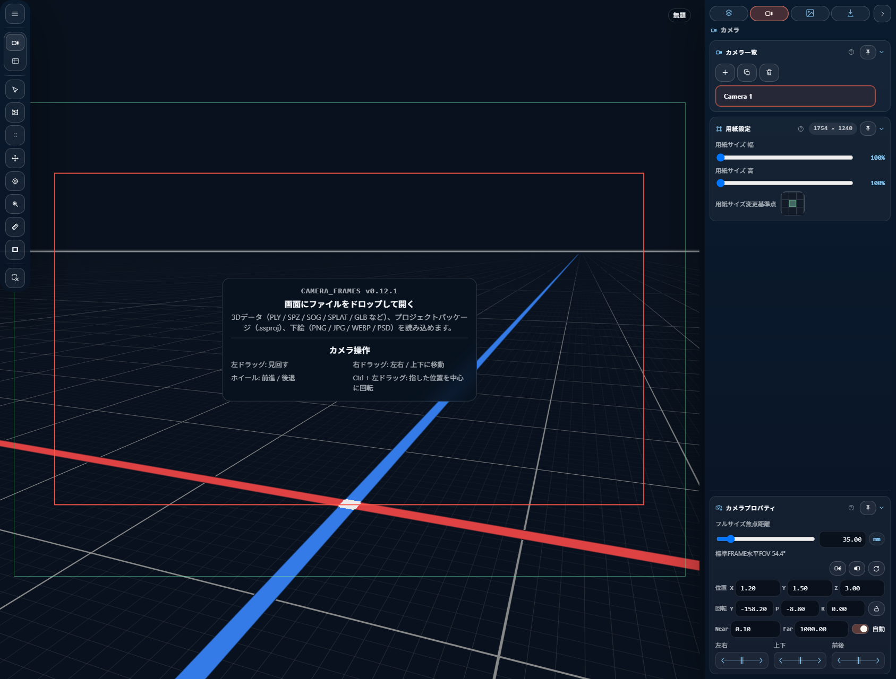

# はじめに

## CAMERA_FRAMES とは

CAMERA_FRAMES は、3D シーンから**構図を確定させて紙面用の出力を作る**ことに特化した DCC ツールです。汎用の 3D ビューアではなく、次の 5 要素を一貫して扱うことを主眼に置いています。

- **shot camera** — 構図ごとに独立したカメラオブジェクト
- **output frame** — 紙面サイズと anchor（基準点）
- **FRAME** — 紙面上に配置する矩形（単独でも複数でも）
- **reference image** — 下絵（preset 単位で管理）
- **export** — PNG / PSD 書き出し

> 💡 **Viewport**（作業用ビュー）と **Camera View**（構図決定ビュー）は別物として扱います。同じ画面ですが役割が違うので、章 [画面構成](02-ui-layout.md) と [Viewport とツール](08-viewport-tools.md) を後で確認してください。

## 起動する

開発モードでは `npm run dev` で Vite サーバを立てます。ブラウザで `http://localhost:3000` を開くと CAMERA_FRAMES が起動します。

初回はシーンが読み込まれていないので、Viewport 上に操作ヒント（drop hint）が表示されます。

## 最初の 5 分

次の流れで、シーンを開いて PNG を出力するまでが試せます。

### 1. シーンを開く

操作方法は 3 通り:

- Viewport にファイルをドロップする（`.ply` / `.spz` / `.splat` / `.ksplat` / `.sog` / `.zip` / `.rad` / `.glb` / `.gltf` に対応）
- Tool Rail の `Open Files...`（`Ctrl+O`）でファイルを選ぶ
- Tool Rail の URL 入力欄に HTTP(S) URL を貼って Load する

対応形式の詳細は [ファイルを開く・保存する](03-open-save.md) を参照してください。

### 2. Viewport で構図を探す

マウスで次の操作ができます。

- 左ドラッグ: orbit（注視点を中心に回転）
- `Ctrl+` 左ドラッグ または 右ドラッグ: ヒット点を中心にアンカーオービット
- マウスホイール: dolly（前後移動）
- 右ボタンドラッグ または `Shift+` 左ドラッグ: pan

詳しくは [Viewport とツール](08-viewport-tools.md) を参照。

### 3. Shot camera を作る

構図が決まったら、Inspector の Camera タブにある **Shot Camera** セクションで shot camera を追加します。これで現在の視点が保存され、後から呼び戻せます。

shot camera は単なる「視点の memo」ではなく、独自の paper size（output frame）を持った **構図ごとのカメラオブジェクト**です。複数の shot を作って、構図のバリエーションを管理できます。

詳しくは [Shot Camera](05-shot-camera.md) を参照。

### 4. Output frame を調整する

Inspector の **Output Frame** セクションで、出力したい紙面サイズ（幅 × 高さ）と anchor（紙面のどこを基準にするか）を調整します。

CAMERA_FRAMES の特徴として、anchor と中心点を維持したまま paper size だけ変えられる仕組み（custom frustum）があります。これにより、構図を壊さずに出力領域の形状だけを変更できます。

詳しくは [Output Frame と FRAME](06-output-frame-and-frames.md) を参照。

### 5. Export する

Inspector の **Export** タブで書き出しを実行します。

- **target** — `current`（現在の shot のみ）/ `all`（全 shot）/ `selected`（選択した shot のみ）
- **format** — `png` または `psd`

`Export` ボタンを押すと、shot camera ごとに output frame で定義された紙面サイズで画像が書き出されます。

詳しくは [Export](10-export.md) を参照。

## 保存する

CAMERA_FRAMES には 2 種類の保存があります。性質が異なるので使い分けてください。

| ショートカット | 保存先 | 用途 |
|---|---|---|
| `Ctrl+S` | **working save** — ブラウザの IndexedDB | 同じブラウザで作業を再開する |
| `Ctrl+Shift+S` | **package save** — `.ssproj` ファイルとしてダウンロード | 別環境に持ち運ぶ / バージョン管理する |

viewport 左上の HUD に保存状態が表示されます:

- `*` — working save が未保存
- `PKG` — `.ssproj` に未反映の変更あり

詳しくは [ファイルを開く・保存する](03-open-save.md) を参照。

## 次に読む

- 画面の各要素の名前と位置: [画面構成](02-ui-layout.md)
- ファイル操作全般: [ファイルを開く・保存する](03-open-save.md)
- 全ショートカット: [キーボードショートカット一覧](11-shortcuts.md)
