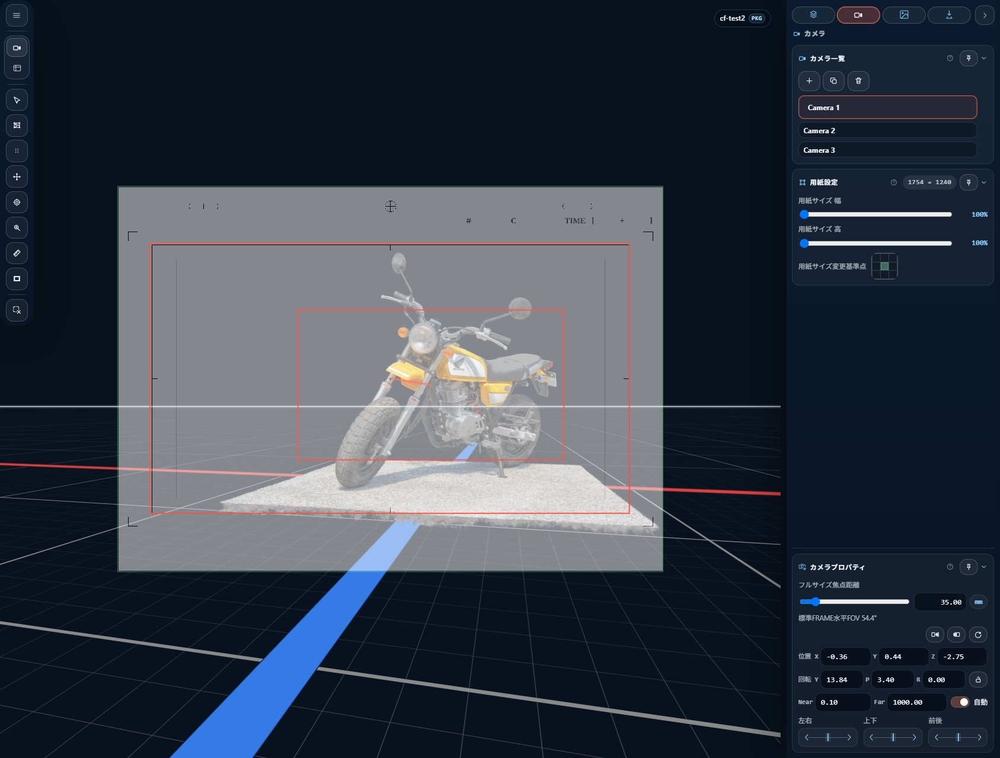

# はじめに

## CAMERA_FRAMES とは

CAMERA_FRAMES は、3DGS を使った 3D ロケーションに 3D オブジェクトを配置し、日本のアニメ制作向けの背景原図を書き出すためのツールです。汎用の 3D ビューアではなく、カットごとの構図、用紙、撮影フレーム、下絵、PSD 書き出しを一貫して扱います。

基準になる用紙は A4 横 150 dpi 相当の **1754 × 1240 px** です。その中に、コンポジットや撮影指示で使う撮影フレームを **FRAME** として配置します。標準の FRAME は 16:9 の **1536 × 864 px** を基準にしています。

- **ショットカメラ** — アニメ制作でいう各カットのカメラです。起動時点で最低 1 つあり、現在選択中のショットカメラを編集します。
- **用紙** — 背景原図として書き出す紙面です。カメラワークやレイアウトに合わせて、アンカーを基点に大判へ広げられます。
- **フレーム** — アニメのレイアウトでいう撮影フレームです。1 つだけ置くことも、複数置いてカメラワークの軌道を指定することもできます。
- **下絵** — レイアウトや参考画像を紙面上に重ねて管理します。
- **書き出し** — PSD を標準形式として、紙面・フレーム・下絵・3D レンダリングを出力します。PSD ではモデルやスプラットをオブジェクト単位のレイヤーとして分けられます。

ビューポートはシーンを確認する作業用ビュー、カメラビューはショットカメラから見た出力確認用ビューです。見ているシーンは同じでも、役割が違います。

## 基本の作業手順

### 1. シーンを開く

操作方法は 3 通り:

- ビューポートにファイルをドロップする（`.ply` / `.spz` / `.splat` / `.kSplat` / `.sog` / `.zip` / `.rad` / `.glb` / `.gltf` に対応）
- ツールレールの `Open Files...`（`Ctrl+O`）でファイルを選ぶ
- ツールレールの URL 入力欄に HTTP(S) URL を貼って `Load` する

対応形式の詳細は [ファイルを開く・保存する](03-open-save.md) を参照してください。

### 2. ショットカメラの構図を決める

起動直後からショットカメラは 1 つ作成され、選択されています。まずはそのショットカメラでカットの構図を決めます。

ビューポートで視点を探し、必要に応じて **Copy ビューポート to Shot** で現在の視点をショットカメラに反映します。別カットや別案が必要な場合は、ショットカメラを追加または複製します。

詳しくは [ショットカメラ](05-shot-camera.md) と [ビューポートとツール](08-viewport-tools.md) を参照してください。

### 3. 用紙を調整する

インスペクターの **用紙** セクションで、背景原図として必要な紙面サイズを調整します。

CAMERA_FRAMES では、アンカーを基点にして構図を保ったまま用紙だけを広げられます。カメラワークに合わせて大判化する場合も、基準位置を崩さずに紙面範囲を変更できます。

詳しくは [用紙とフレーム](06-output-frame-and-frames.md) を参照。

### 4. フレームを置く

紙面内に **FRAME** を配置します。

1 つの FRAME は静止カットの撮影フレームとして使います。複数の FRAME を置くと、開始フレームから終了フレームまでの軌道を指定でき、PAN、TU/TB、ズームなどのカメラワーク指示に使えます。

### 5. PSD を書き出す

**書き出し** タブで出力対象を選び、PSD として書き出します。

PSD では、レンダリング結果に加えて、下絵、ガイド、フレーム、軌道、モデルレイヤー、スプラットレイヤーを分けて出力できます。背景原図の後工程で、Photoshop 側の調整や合成に渡しやすい構造になります。

詳しくは [書き出し](10-export.md) を参照。

## 保存する

CAMERA_FRAMES には 2 種類の保存があります。性質が異なるので使い分けてください。

| ショートカット | 保存先 | 用途 |
|---|---|---|
| `Ctrl+S` | **作業保存** — ブラウザの IndexedDB | 同じブラウザで作業を再開する |
| `Ctrl+Shift+S` | **パッケージ保存** — `.ssproj` ファイルとしてダウンロード | 別環境へ持ち運ぶ / バージョン管理する |

ビューポート右上の HUD に保存状態が表示されます:

- `*` — 作業保存が未保存
- `PKG` — `.ssproj` に未反映の変更あり

詳しくは [ファイルを開く・保存する](03-open-save.md) を参照。

## 次に読む

- 画面の各要素の名前と位置: [画面構成](02-ui-layout.md)
- ファイル操作全般: [ファイルを開く・保存する](03-open-save.md)
- ショットカメラの詳細: [ショットカメラ](05-shot-camera.md)
- 用紙とフレームの詳細: [用紙とフレーム](06-output-frame-and-frames.md)
- PSD 書き出しの詳細: [書き出し](10-export.md)
- 全ショートカット: [キーボードショートカット一覧](11-shortcuts.md)
