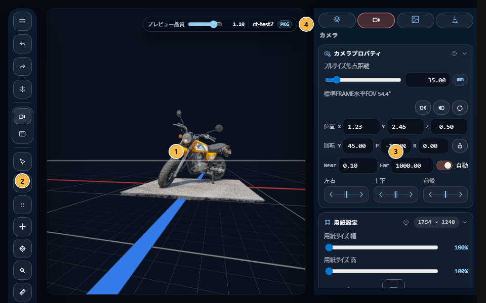
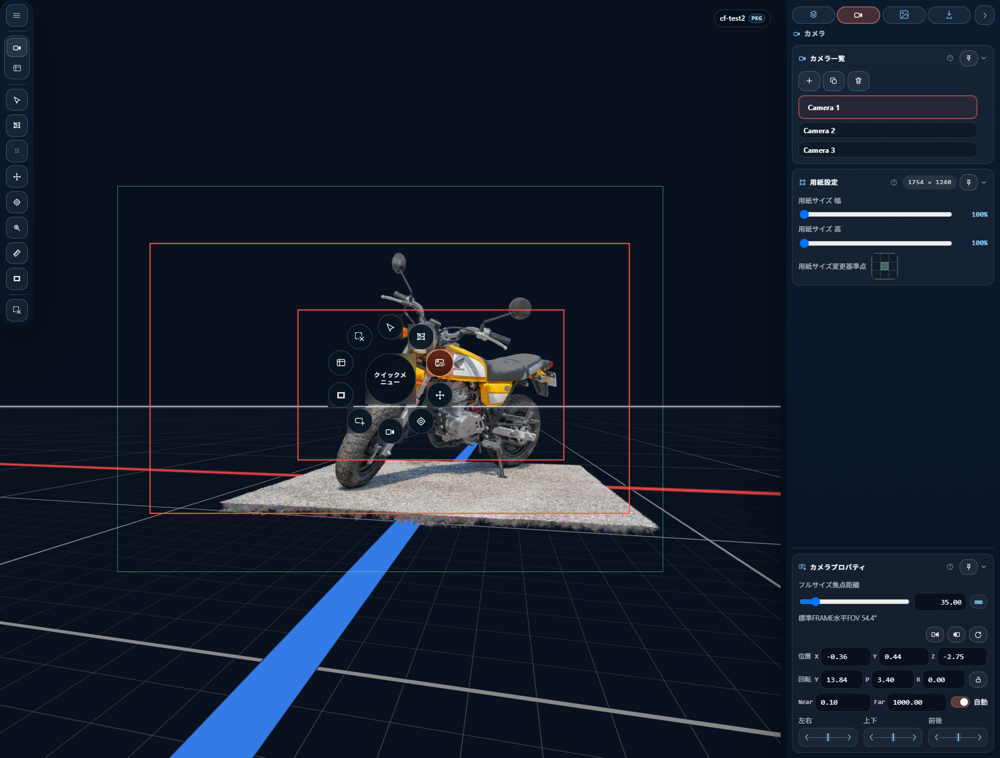
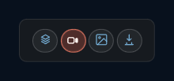
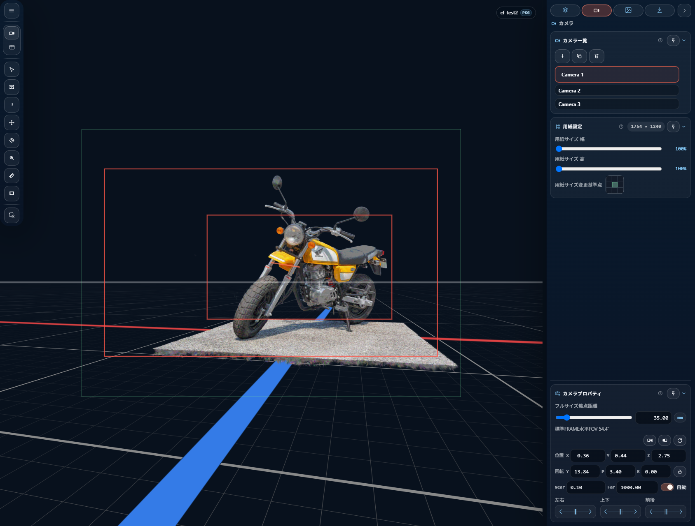

# 画面構成

CAMERA_FRAMES の画面は、大きく次の 3 領域と、画面上に重ねて表示される overlay 群で構成されます。

- **ビューポート**（中央） — 3D シーン表示と直接操作
- **ツールレール**（左、ドラッグ可能） — ファイル操作、ツール切替、クイックメニュー
- **インスペクター**（右、折りたたみ可能） — シーン・カメラ・下絵・書き出しの詳細編集

## 1. ビューポート

3D シーンが描画される主領域です。ビューポート には 2 つのモードがあります。

- **ビューポートモード** — エディタ用の作業カメラ。orbit / pan / dolly で自由に視点を動かせる
- **カメラモード** — 現在の ショットカメラ の視点。この視点がそのまま 書き出し に対応する

モード切替は パイメニュー（中ボタンドラッグ）または ツールレール の「カメラ/ビューポート」ボタンから行います。

### ビューポート 上の overlay 要素

ビューポート には次の要素が重なります。

#### Project Status HUD（左上）

プロジェクト名と保存状態を表示します。

- プロジェクト名 — 未保存の場合は `Untitled`
- `*` — 作業保存 に未保存の変更がある
- `PKG` — package（`.ssproj`）に未反映の変更がある

#### 用紙枠（出力フレーム枠）

カメラモード で表示される**紙面枠**。この枠の中身がそのまま 書き出し 出力になります。

- 8 つのリサイズハンドル（四隅 + 各辺中央）
- 4 つのパンエッジ（各辺）
- 枠の下に出力サイズと アンカー のメタ情報
- 中央に アンカー dot

詳しくは [用紙 と フレーム](06-output-frame-and-frames.md) を参照。

#### フレーム 群

用紙枠内に配置される撮影フレーム（アニメの撮影指示で使うフレーム）。複数配置でき、選択・移動・回転・リサイズ・アンカー編集に対応します。spline モードでは フレーム中心 を繋ぐパスを編集してカメラワークの軌道を作れます。

詳しくは [用紙 と フレーム](06-output-frame-and-frames.md) を参照。

#### 下絵レイヤー（下絵）

ショットカメラ に紐付いた 下絵 が ビューポート 上に重なります。

- **back** グループ — シーンの後ろ
- **front** グループ — シーンの前
- 編集モード中は選択ハンドルや回転ゾーンが表示される

詳しくは [リファレンス画像](07-reference-images.md) を参照。

#### パイメニュー（中ボタンドラッグで出現）

よく使う操作を円形に並べたクイックメニュー。中央付近で離すと何も実行されません。

項目（時計回り、12 時方向を起点）:

1. **選択** — 選択ツール
2. **下絵編集** — 下絵 編集ツール
3. **下絵表示切替** — 下絵 プレビューの表示切替
4. **変形** — 変形ツール
5. **ピボット** — ピボット 編集ツール
6. **レンズ調整** — レンズ（焦点距離 / FOV）調整モード
7. **新規フレーム** — フレームを追加
8. **フレームマスク切替** — フレームマスク 表示切替
9. **カメラ/ビューポート** — ビューポートモード ↔ カメラモード の切替
10. **選択クリア** — 選択をクリア

#### レンズ HUD / ロール HUD

レンズ調整モードや ロール調整モード中に、マウス近くに値（mm / 度）を表示します。

#### Axis Gizmo

現在の視点の軸方向を表示する小さなウィジェット。各軸ボタンをクリックで正面 / 背面ビューに切替できます（X/Y/Z それぞれに正側・負側・軸トグルの 3 ボタン）。

#### Transform Gizmo

オブジェクト選択中かつ 変形ツール使用時に表示される、移動・回転・スケール操作用のハンドル群。XY / YZ / ZX プレーン、X / Y / Z 軸ハンドル、均等スケールハンドルを持ちます。

#### Measurement Overlay（測定モード時、`M` キー）

2 点を指定して距離を測ります。距離値を入力すると、その値に合わせてシーンのスケール調整もできます。

#### スプラット編集 Brush Preview

スプラット編集 の brush ツール使用時に、カーソル位置にリング状のブラシプレビューが表示されます。`Alt` 押下で削除（subtract）モード、ペイント中は塗り状態のスタイルに切り替わります。

#### Drop Hint

シーン未読込時に表示される操作ヒント。orbit / pan / dolly / アンカー orbit の案内が出ます。

#### スプラット編集 Toolbar

スプラット編集 モード（`Shift+E`）に入ると、ビューポート 内にドラッグ可能なツールバーが現れます（後述）。

## 2. ツールレール（左）

画面左に浮遊する、ドラッグ可能なツール群です。コンパクト表示では位置と形状が変わります。

### ヘッダーメニュー

| ラベル | アイコン | ショートカット |
|---|---|---|
| New Project | {{icon:plus}} | `Ctrl+N` |
| Open Files | {{icon:folder-open}} | `Ctrl+O` |
| Save Working State | {{icon:save}} | `Ctrl+S` |
| Save Package | {{icon:package}} | `Ctrl+Shift+S` |

### Remote URL

HTTP(S) URL を入力して Load ボタンで読み込む欄。外部ホストの scene asset を取り込めます。

### インスペクター Collapse Toggle

インスペクター を折りたたむ / 展開するボタン（{{icon:chevron-left}} / {{icon:chevron-right}}）。

### Quick Menu / Zoom Popover

現在のモードに応じて出現する補助ポップオーバー:

- **ビューポートモード** — Lens / FOV 設定
- **カメラモード** — Zoom / View 設定

### ツールボタン

| ラベル | 動作 | ショートカット |
|---|---|---|
| Select | 選択ツール | `V` |
| Transform | 変形ツール | `T` |
| Pivot | Pivot 編集 | `Q` |
| Reference Edit | 下絵 編集 | `Shift+R` |
| Measurement | 距離測定 | `M` |
| Zoom | ズームツール | `Z` |
| スプラット編集 | スプラット per-point 編集 | `Shift+E` |

詳しい挙動は [ビューポート とツール](08-viewport-tools.md)。

### Frame / Mask ツール

- **New Frame** — フレーム を追加
- **フレームマスク 設定** — mask mode（off / all / selected）、opacity、shape（bounds / 軌道）、軌道 書き出し source
- **Reference Preview 表示切替**（`R`）

詳しくは [用紙 と フレーム](06-output-frame-and-frames.md)。

## 3. インスペクター（右）

右側のサイドパネル。タブごとに内容が切り替わり、折りたたみ可能です。

### 4 つのタブ

| タブ | アイコン | 主な用途 |
|---|---|---|
| **Scene** | {{icon:scene}} | シーンアセット（スプラット / model）の管理、照明、選択アセットの transform |
| **Camera** | {{icon:camera-dslr}} | Shot camera の管理、カメラプロパティ、用紙 |
| **下絵編集** | {{icon:image}} | 下絵 の プリセット、一覧、プロパティ |
| **書き出し** | {{icon:export-tab}} | 出力設定と書き出し |

### 各タブのセクション

#### Scene タブ

- **シーンマネージャー** — スプラット / model アセットの一覧、表示切替、並び替え、削除
- **Lighting** — 照明の方向・強度
- **オブジェクトプロパティ** — 選択中アセットの transform（translate / rotate / scale / unit / content transform / working pivot）

詳しくは [シーンアセット](04-scene-assets.md)。

#### Camera タブ

- **カメラ一覧** — ショットカメラ一覧、追加、選択、削除、並び替え、書き出し name 編集
- **カメラプロパティ** — active shot の pose、lens、clipping、ロールロック
- **用紙** — 紙面サイズ（width × height）、アンカー 3×3、center / fit / 表示ズーム

詳しくは [ショットカメラ](05-shot-camera.md) と [用紙 と フレーム](06-output-frame-and-frames.md)。

#### Reference タブ

- **下絵プリセット** — プリセット 作成・切替・削除、現 shot への binding
- **下絵マネージャー** — active プリセット 内の item 一覧、表示切替、前後グループ、書き出し対象切替
- **下絵プロパティ** — 選択 item の位置・回転・拡縮、multi-selection 一括変換

詳しくは [リファレンス画像](07-reference-images.md)。

#### 書き出し タブ

- **Output** — 書き出し実行、target（`current` / `all` / `selected`）、format（PNG / PSD）
- **書き出し設定** — PSD layer options、grid、下絵 参加有無、書き出しファイル名

詳しくは [書き出し](10-export.md)。

### セクションの共通機能

- **折りたたみ** — 見出しをクリック
- **ピン留め** — 各セクション見出しの Pin ボタンで、インスペクター 右端の Peek パネルに集約表示
- **順序** — セクションはタブごとに固定順（ピン留めした並びは Peek 専用）

## 4. スプラット編集 Toolbar

スプラット編集 モード（`Shift+E`）に入ると ビューポート 内に現れるツールバー。ドラッグで位置を移動できます。

### ツール選択グループ

- **Box** — 矩形選択
- **Brush** — ブラシ選択（`Alt` で削除）
- **Transform** — 選択 スプラット の変形

### 選択操作グループ

- **Select All**（`Ctrl+A`）
- **Invert**（`Ctrl+I`）
- **Clear**（`Ctrl+D`）

### 編集アクショングループ

- **Delete** — 選択 スプラット を削除
- **Separate** — 選択 スプラット を別アセットとして切り出し
- **Duplicate** — 選択 スプラット を複製

### 選択数表示

右端に現在の選択数（`42 sel` など）。

詳しくは [スプラット編集](09-per-splat-edit.md)。

## 5. Overlay（モーダルダイアログ）

画面全体を覆うダイアログは 3 種類あります。

| 種類 | 用途 | 主な要素 |
|---|---|---|
| **Confirm** | 上書き / 削除などの意思決定 | タイトル、本文、URL 一覧、追加フィールド、アクションボタン |
| **Progress** | 書き出し / 大きな import の進捗 | 進捗バー、フェーズ一覧、ステップ一覧、経過時間 |
| **Error** | エラー通知 | タイトル、本文、詳細（折りたたみ可能）、URL 一覧、エラー詳細 pre |

## 6. モバイル / コンパクト表示

画面幅が狭いとき、ツールレール と インスペクター の配置は次のように変わります。

- インスペクター は右全幅のドロワーまたは画面下部ドロワーに切り替わる
- ツールレール は下部ドックに変形し、必要最低限のボタンに集約
- タブ切替は常時可能、ピン機能は一部制限

基本的な操作は同じですが、レイアウトが調整されます。

### UI 倍率（モバイル時のみ）

モバイル UI では、端末ごとのボタンや文字の見え方の違いを吸収するために **UI 倍率スライダー** が使えます。

- 下部ドック右端の **歯車アイコン** から設定モーダルを開く
- スライダー（0.70〜2.00、0.01 刻み）で倍率を調整
- モバイルドック、パイメニュー、ドロワー内の主要ボタン、設定モーダル自身がすべて同じ倍率で拡縮する
- 推奨値（端末から自動算出）は参考表示され、「推奨値に戻す」で自動値に戻せる
- 設定は `localStorage`（`camera-frames.mobileUiScale`）に保存され、次回起動時に復元される
- ビューポート（WebGL 描画）、用紙枠、フレーム、下絵、書き出し出力は **UI 倍率の影響を受けない**（preview/export 一致の契約として固定）
- PC / デスクトップ環境では UI 倍率は常に 1 倍で、歯車アイコン自体が出ない

## 次に読む

- 実際の操作方法: [ビューポート とツール](08-viewport-tools.md)
- 機能別の詳細: 各章（目次から選択）
- 全ショートカット: [キーボードショートカット一覧](11-shortcuts.md)
