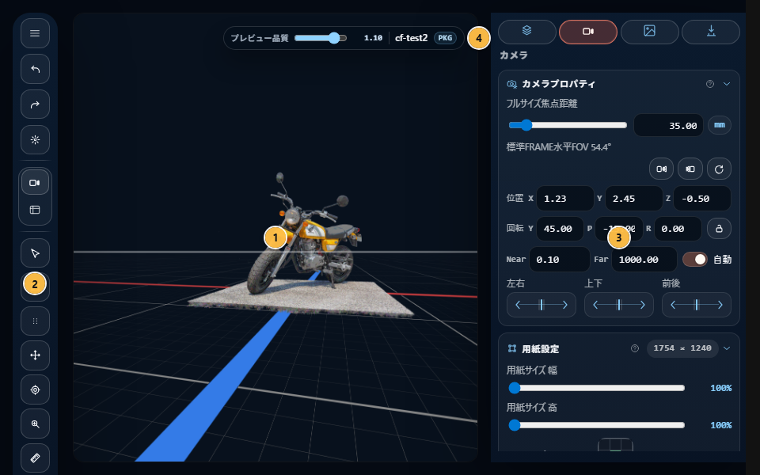
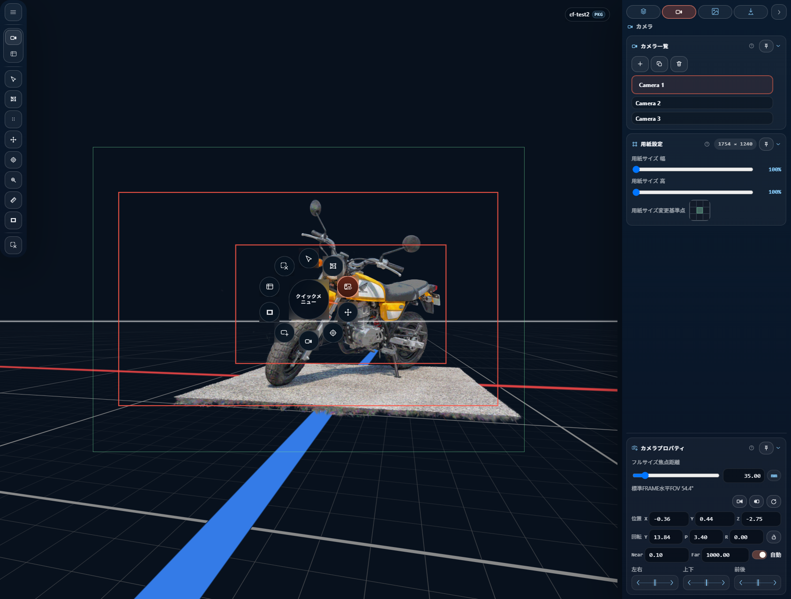
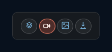
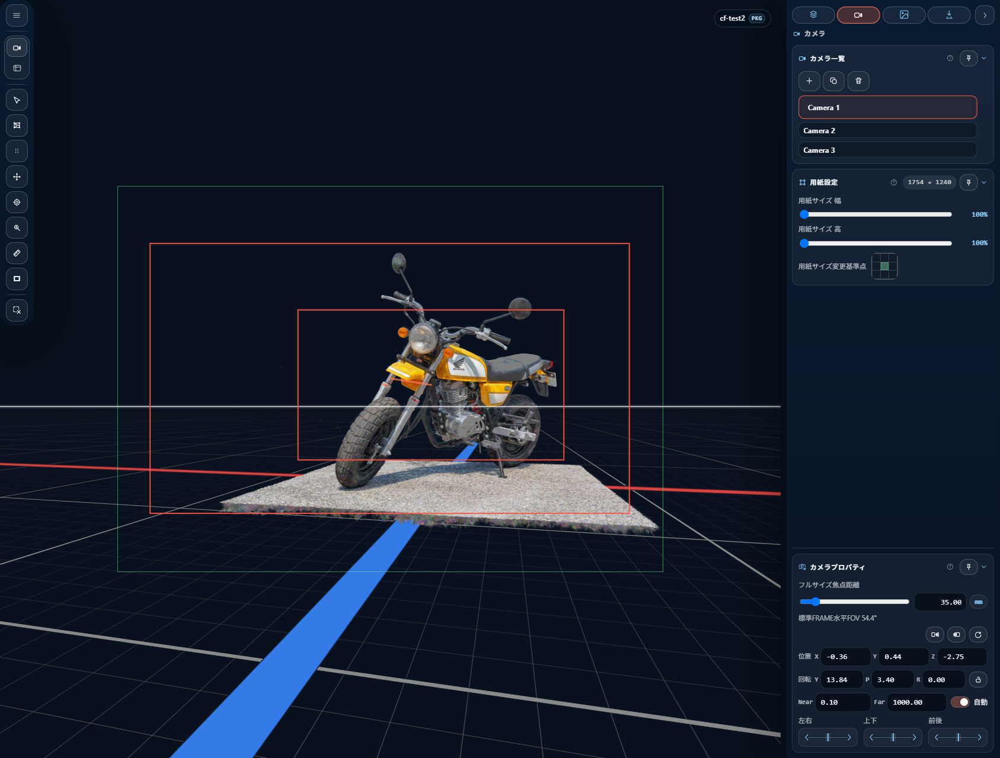

# 画面構成

CAMERA_FRAMES の画面は、大きく次の 3 領域と、画面上に重ねて表示されるオーバーレイ群で構成されます。

- **ビュー領域**（中央） — Camera View / Viewport での 3D シーン表示と直接操作
- **ツールレール**（左、ドラッグ可能） — ファイル操作、ツール切替、クイックメニュー
- **インスペクター**（右、折りたたみ可能） — シーン・カメラ・下絵・書き出しの詳細編集

1. **ビュー領域** — Camera View / Viewport の表示と直接操作を行う中央領域。画像は既定の Camera View 1 画面
2. **ツールレール** — ファイル操作、ツール切替、クイックメニューをまとめた左側のパネル
3. **インスペクター** — シーン・カメラ・下絵・書き出しの詳細を編集する右側のパネル
4. **プロジェクト状態 HUD** — プロジェクト名、保存状態、プレビュー品質を表示するビュー領域右上の表示

## 1. Camera View / Viewport

3D シーンが描画される主領域です。保存済みの端末設定がない時は従来と同じ **Camera View 1 画面**で、必要な時だけ **2画面**にできます。

- **Camera View** — 現在選択しているショットカメラの視点。用紙、フレーム、下絵を確認し、この視点が書き出しに対応する
- **Viewport** — エディタ用の作業カメラ。ショットカメラとは別に、オービット / パン / ドリーや正投影で自由にシーンを確認する

### 1.1 2画面の使い方

1. **2画面**ボタンを押すと、Camera View と Viewport を同時に表示します
2. 2画面の間にある divider を pointer でドラッグすると、表示サイズの比率を変更できます
3. divider に keyboard focus がある時は、矢印キーでも比率を変更できます
4. 片方だけで作業したい時は、不要な pane header の閉じるボタンを押します。残った pane が全画面になります
5. 再び両方を見たい時は **2画面**ボタンを押します

画面の横幅が狭い時は、2画面は左右ではなく上下に並びます。

### 1.2 操作対象の pane

2画面では、click した pane が操作対象になります。keyboard / pointer による視点操作やツール操作は、操作対象の pane にだけ適用されます。

- Camera View を操作すると、選択中のショットカメラが動きます
- Viewport を操作すると、エディタ用のビューポートカメラが動きます
- ショットカメラを選び直すと、Camera View は新しく選択したカメラへ切り替わります

パイメニュー（中ボタンドラッグ）やツールレールの **カメラ/ビューポート** 操作でも、表示または操作対象の view を切り替えられます。

### 1.3 レイアウトの保存範囲

1画面 / 2画面、divider の比率、最後に操作した pane は、この端末の UI 設定として記憶されます。

- `.ssproj` には含まれず、別の端末へ持ち運ばれません
- undo / redo の対象になりません
- divider の移動や pane の開閉だけでは、プロジェクトに未保存変更の印は付きません

### ビュー領域上のオーバーレイ要素

Camera View / Viewport には、役割に応じて次の要素が重なります。

#### プロジェクト状態 HUD（右上）

プロジェクト名、保存状態、ビュー領域の 3DGS プレビュー品質を表示します。

- プレビュー品質 — 3DGS が重いときに、ビューポート表示の軽さと細部の見やすさを調整する端末ごとの設定
- プロジェクト名 — 未保存の場合は `Untitled`
- `*` — 作業保存に未保存の変更がある
- `PKG` — パッケージ（`.ssproj`）に未反映の変更がある

#### 用紙枠（出力フレーム枠）

Camera View に表示される**紙面枠**。この枠の中身がそのまま書き出し出力になります。Viewport には表示されません。

- 8 つのリサイズハンドル（四隅 + 各辺中央）
- 4 つのパンエッジ（各辺）
- 枠の下に出力サイズとアンカーのメタ情報
- 中央にアンカー点

詳しくは [用紙とフレーム](06-output-frame-and-frames.md) を参照。

#### フレーム群

用紙枠内に配置される撮影フレーム（アニメの撮影指示で使うフレーム）。複数配置でき、選択・移動・回転・リサイズ・アンカー編集に対応します。スプラインモードではフレーム中心を繋ぐパスを編集してカメラワークの軌道を作れます。

詳しくは [用紙とフレーム](06-output-frame-and-frames.md) を参照。

#### 下絵レイヤー（下絵）

ショットカメラに紐付いた下絵が、表示中の view に重なります。Camera View では用紙を基準に配置・編集できます。2 画面表示中は重複を避けるため Camera View 側に合成され、Camera View を閉じて Viewport だけにした場合は従来どおり Viewport 上でプレビュー・編集できます。

- **背面グループ** — シーンの後ろ
- **前面グループ** — シーンの前
- 編集モード中は選択ハンドルや回転ゾーンが表示される

詳しくは [下絵](07-reference-images.md) を参照。

#### パイメニュー（中ボタンドラッグで出現）

よく使う操作を円形に並べたクイックメニュー。中央付近で離すと何も実行されません。

項目（時計回り、12 時方向を起点）:

1. **選択** — 選択ツール
2. **下絵編集** — 下絵編集ツール
3. **下絵表示切替** — 下絵プレビューの表示切替
4. **変形** — 変形ツール
5. **ピボット** — ピボット編集ツール
6. **レンズ調整** — レンズ（焦点距離 / FOV）調整モード
7. **新規フレーム** — フレームを追加
8. **フレームマスク切替** — フレームマスク表示切替
9. **カメラ/ビューポート** — 表示または操作対象の Camera View / Viewport を切替
10. **選択クリア** — 選択をクリア

#### レンズ HUD / ロール HUD

レンズ調整モードやロール調整モード中に、マウス近くに値（mm / 度）を表示します。

#### 軸ギズモ

Viewport カメラの軸方向を表示する小さなウィジェット。各軸ボタンをクリックで正面 / 背面ビューに切替できます（X/Y/Z それぞれに正側・負側・軸トグルの 3 ボタン）。

#### 変形ギズモ

オブジェクト選択中かつ 変形ツール使用時に表示される、移動・回転・スケール操作用のハンドル群。XY / YZ / ZX プレーン、X / Y / Z 軸ハンドル、均等スケールハンドルを持ちます。

#### 測定オーバーレイ（測定モード時、`M` キー）

2 点を指定して距離を測ります。距離値を入力すると、その値に合わせてシーンのスケール調整もできます。

#### スプラット編集ブラシプレビュー

スプラット編集のブラシツール使用時に、カーソル位置にリング状のブラシプレビューが表示されます。`Alt` 押下で減算モード、ペイント中は塗り状態のスタイルに切り替わります。

#### 操作ヒント

シーン未読込時に表示される操作ヒント。オービット / パン / ドリー / アンカーオービットの案内が出ます。

#### スプラット編集ツールバー

スプラット編集モード（`Shift+E`）に入ると、ビューポート内にドラッグ可能なツールバーが現れます（後述）。

## 2. ツールレール（左）

画面左に浮遊する、ドラッグ可能なツール群です。コンパクト表示では位置と形状が変わります。

### ヘッダーメニュー

| ラベル | アイコン | ショートカット |
|---|---|---|
| New Project | {{icon:plus}} | `Ctrl+N` |
| Open Files | {{icon:folder-open}} | `Ctrl+O` |
| Save Working State | {{icon:save}} | `Ctrl+S` |
| Save Package | {{icon:package}} | `Ctrl+Shift+S` |

### リモート URL

HTTP(S) URL を入力して `Load` ボタンで読み込む欄。外部ホストのシーンアセットを取り込めます。

### インスペクター折りたたみボタン

インスペクター を折りたたむ / 展開するボタン（{{icon:chevron-left}} / {{icon:chevron-right}}）。

### クイックメニュー / ズームポップオーバー

現在操作している view に応じて出現する補助ポップオーバー:

- **Viewport** — レンズ / FOV 設定
- **Camera View** — ズーム / 表示設定

### ツールボタン

| ラベル | 動作 | ショートカット |
|---|---|---|
| Select | 選択ツール | `V` |
| Transform | 変形ツール | `T` |
| Pivot | ピボット編集 | `Q` |
| Reference Edit | 下絵編集 | `Shift+R` |
| Measurement | 距離測定 | `M` |
| Zoom | ズームツール | `Z` |
| スプラット編集 | スプラット個別編集 | `Shift+E` |

詳しい挙動は [ビューポートとツール](08-viewport-tools.md)。

### フレーム / マスクツール

- **New Frame** — フレームを追加
- **フレームマスク設定** — マスクモード（off / all / selected）、不透明度、形状（bounds / 軌道）、軌道書き出し元
- **下絵プレビュー表示切替**（`R`）

詳しくは [用紙とフレーム](06-output-frame-and-frames.md)。

## 3. インスペクター（右）

右側のサイドパネル。タブごとに内容が切り替わり、折りたたみ可能です。

### 4 つのタブ

| タブ | アイコン | 主な用途 |
|---|---|---|
| **Scene** | {{icon:scene}} | シーンアセット（スプラット / モデル）の管理、照明、選択アセットの変形 |
| **Camera** | {{icon:camera-dslr}} | ショットカメラの管理、カメラプロパティ、用紙 |
| **下絵編集** | {{icon:image}} | 下絵のプリセット、一覧、プロパティ |
| **書き出し** | {{icon:export-tab}} | 出力設定と書き出し |

### 各タブのセクション

#### Scene タブ

- **シーンマネージャー** — スプラット / モデルアセットの一覧、表示切替、並び替え、削除
- **Lighting** — 照明の方向・強度
- **オブジェクトプロパティ** — 選択中アセットの変形（位置 / 回転 / スケール / 単位 / コンテンツ変形 / 作業ピボット）

詳しくは [シーンアセット](04-scene-assets.md)。

#### Camera タブ

- **カメラ一覧** — ショットカメラ一覧、追加、選択、削除、並び替え、書き出しファイル名編集
- **カメラプロパティ** — アクティブなショットカメラの位置・回転、レンズ、クリッピング、ロールロック
- **用紙** — 紙面サイズ（幅 × 高さ）、アンカー 3×3、中心 / フィット / 表示ズーム

詳しくは [ショットカメラ](05-shot-camera.md) と [用紙とフレーム](06-output-frame-and-frames.md)。

#### 下絵編集タブ

- **下絵プリセット** — プリセット作成・切替・削除、現在のショットカメラへの紐付け
- **下絵マネージャー** — アクティブなプリセット内のアイテム一覧、表示切替、前後グループ、書き出し対象切替
- **下絵プロパティ** — 選択アイテムの位置・回転・拡縮、複数選択時の一括変換

詳しくは [下絵](07-reference-images.md)。

#### 書き出しタブ

- **出力** — 書き出し実行、対象（`current` / `all` / `selected`）、形式（PNG / PSD）
- **書き出し設定** — PSD レイヤー設定、グリッド、下絵の参加有無、書き出しファイル名

詳しくは [書き出し](10-export.md)。

### セクションの共通機能

- **折りたたみ** — 見出しをクリック
- **ピン留め** — 各セクション見出しの `Pin` ボタンで、インスペクター右端の `Peek` パネルに集約表示
- **順序** — セクションはタブごとに固定順（ピン留めした並びは `Peek` 専用）

## 4. スプラット編集ツールバー

スプラット編集モード（`Shift+E`）に入るとビューポート内に現れるツールバー。ドラッグで位置を移動できます。

### ツール選択グループ

- **Box** — 矩形選択
- **Brush** — ブラシ選択（`Alt` で削除）
- **Transform** — 選択スプラットの変形

### 選択操作グループ

- **Select All**（`Ctrl+A`）
- **Invert**（`Ctrl+I`）
- **Clear**（`Ctrl+D`）

### 編集アクショングループ

- **Delete** — 選択スプラットを削除
- **Separate** — 選択スプラットを別アセットとして切り出し
- **Duplicate** — 選択スプラットを複製

### 選択数表示

右端に現在の選択数（`42 sel` など）。

詳しくは [スプラット編集](09-per-splat-edit.md)。

## 5. オーバーレイ（モーダルダイアログ）

画面全体を覆うダイアログは 3 種類あります。

| 種類 | 用途 | 主な要素 |
|---|---|---|
| **確認** | 上書き / 削除などの意思決定 | タイトル、本文、URL 一覧、追加フィールド、アクションボタン |
| **進捗** | 書き出し / 大きな読み込みの進捗 | 進捗バー、フェーズ一覧、ステップ一覧、経過時間 |
| **エラー** | エラー通知 | タイトル、本文、詳細（折りたたみ可能）、URL 一覧、エラー詳細 |

## 6. モバイル / コンパクト表示

画面幅が狭いとき、ビュー領域、ツールレール、インスペクターの配置は次のように変わります。

- 2画面は左右分割から上下分割へ切り替わる
- インスペクターは右全幅のドロワーまたは画面下部ドロワーに切り替わる
- ツールレールは下部ドックに変形し、必要最低限のボタンに集約
- タブ切替は常時可能、ピン機能は一部制限

基本的な操作は同じですが、レイアウトが調整されます。

### UI 倍率（モバイル時のみ）

モバイル UI では、端末ごとのボタンや文字の見え方の違いを吸収するために **UI 倍率スライダー** が使えます。

- 下部ドック右端の **歯車アイコン** から設定モーダルを開く
- スライダー（0.70〜2.00、0.01 刻み）で倍率を調整
- モバイルドック、パイメニュー、ドロワー内の主要ボタン、設定モーダル自身がすべて同じ倍率で拡縮する
- 推奨値（端末から自動算出）は参考表示され、「推奨値に戻す」で自動値に戻せる
- 設定は `localStorage`（`camera-frames.mobileUiScale`）に保存され、次回起動時に復元される
- Camera View / Viewport（WebGL 描画）、用紙枠、フレーム、下絵、書き出し出力は **UI 倍率の影響を受けない**（プレビューと書き出しの一致契約として固定）
- PC / デスクトップ環境では UI 倍率は常に 1 倍で、歯車アイコン自体が出ない

## 次に読む

- 実際の操作方法: [ビューポートとツール](08-viewport-tools.md)
- 機能別の詳細: 各章（目次から選択）
- 全ショートカット: [キーボードショートカット一覧](11-shortcuts.md)
