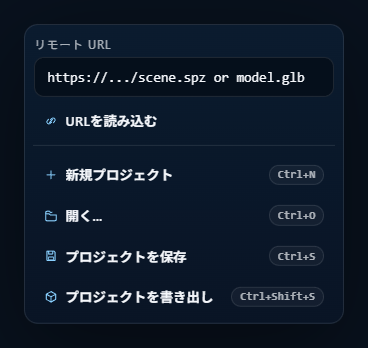
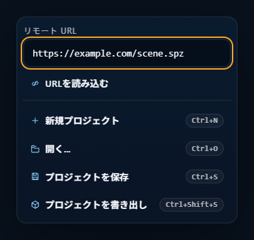
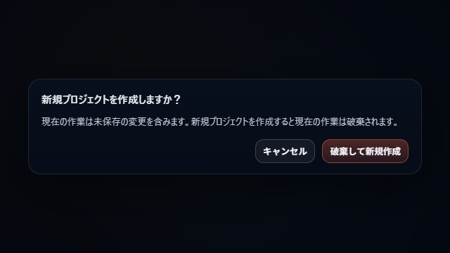

# ファイルを開く・保存する

CAMERA_FRAMES のファイル操作は、**Import**（scene asset / 下絵 / project を読む）と **Save**（作業保存 と パッケージ保存）の 2 系統で構成されます。

## 1. 開く（Import）

### 1.1 4 つの入口

どの方法で開いても、ファイル種別に応じた routing に振り分けられます。

| 入口 | 操作 |
|---|---|
| **File メニュー**（ツールレール） | `Open Files...`（`Ctrl+O`）でファイルダイアログ |
| **Drag & Drop** | ビューポート にファイルをドロップ |
| **Remote URL** | ツールレール の URL 入力欄に `http://` / `https://` の URL を貼って Load |
| **起動時 URL パラメータ** | ブラウザに `?load=<URL>` 付きでアクセス |

### 1.2 対応ファイル形式

| カテゴリ | 拡張子 |
|---|---|
| **Scene asset** | `.ply` / `.spz` / `.splat` / `.kSplat` / `.sog` / `.zip` / `.rad` / `.glb` / `.gltf` |
| **下絵** | `.png` / `.jpg` / `.jpeg` / `.webp` / `.psd` |
| **Project** | `.ssproj` |

PSD は leaf layer が individual reference item として展開されます。詳しくは [リファレンス画像](07-reference-images.md)。

### 1.3 複数ファイルを同時に開いたとき

一度に複数を選択 / ドロップすると、次の順で振り分けられます。

1. **単独の `.ssproj`** → プロジェクトとして開く
2. **それ以外**:
   - 下絵 対応ファイル → 下絵 import
   - 残り → scene asset import

scene asset と 下絵 を混ぜても、それぞれ対応した routing に自動で流れます。

### 1.4 Remote URL から読み込む

ツールレール の URL 入力欄で、複数 URL を一度に指定できます。

- **区切り文字** — 改行、カンマ、空白
- **プロトコル制約** — `http://` または `https://` のみ（その他は除外）

Enter または Load ボタンで取り込みます。

### 1.5 起動時 URL パラメータ（`?load=`）

アプリ URL に `?load=<URL>` を付けて起動すると、ページロード直後にその URL を import します。`?load=A&load=B` のように複数指定できます。

- HTTPS 要件・private host などの安全性検証に引っかかった URL は警告され、読み込まれない
- 安全性検証を通った URL は **Startup Import** 確認ダイアログで「Continue Load」を押した時点で import が始まる

### 1.6 Legacy `.ssproj` の読み込み

旧 CAMERA_FRAMES の `.ssproj`（`manifest.json` を含まず `document.json` ベース）は、現行フォーマットでの読み込みに失敗した時点で自動的に fallback import に切り替わります。

fallback で次が再現されます。

- `cameraFramesState.renderBox` → 現行の 用紙
- `cameraFramesState.cameraPresets[]` → ショットカメラ一覧
- `cameraFramesState.フレーム[]` → フレーム 一覧（transform・アンカー 含む）
- 旧 yaw / pitch / roll → 現行 quaternion への変換

legacy 側の細かな値（tiny scale など）は見た目が同じになるよう補正付きで展開され、勝手に「見やすい値」へは変換しません。

詳細な契約は [legacy-ssproj-compatibility.md](../../legacy-ssproj-compatibility.md) を参照。

## 2. 保存する

CAMERA_FRAMES の保存は **作業保存**（ブラウザ内）と **パッケージ保存**（ファイルダウンロード）の 2 種類です。性質が異なるので使い分けます。

### 2.1 2 種類の保存

| | 作業保存 | パッケージ保存 |
|---|---|---|
| **ショートカット** | `Ctrl+S` | `Ctrl+Shift+S` |
| **保存先** | ブラウザ IndexedDB | `.ssproj` ファイル（ダウンロード） |
| **用途** | 同じブラウザで作業再開 | 別環境に持ち運ぶ / バックアップ |
| **容量** | IndexedDB 制約内 | ファイルシステム制約内 |

### 2.2 作業保存 の詳細

`Ctrl+S` は、プロジェクトの状態で挙動が変わります。

- **`projectId` と `packageFingerprint` が両方揃っている場合**（＝ `.ssproj` を開いた直後 or 以前に パッケージ保存 した状態）— IndexedDB に 作業保存
- **どちらかが欠けている場合**（新規プロジェクトで open なしに作業を始めたとき）— パッケージ保存 にフォールバック（`.ssproj` のダウンロードを促される）

初回 作業保存 時は、説明の確認ダイアログが出ます（`Continue Save` で実行）。

### 2.3 パッケージ保存 の詳細

`Ctrl+Shift+S` で `.ssproj` をダウンロードします。確認ダイアログで以下を設定できます。

**SOG 圧縮**（WebGPU 必須）

- `Compress splats to SOG` の有無
- `Max SH bands`: `0` / `1` / `2` / `3`
- `Iterations`: `4` / `8` / `10` / `12` / `16`

**保存先**

- 元の `.ssproj` を上書き（`Overwrite Package`）
- 別名保存（`Save Package As`）
- 初回 書き出し なら `書き出し Project`

パッケージ保存 が成功すると、対応する 作業保存 は削除され、`packageRevision` がインクリメントされます。

### 2.4 `.ssproj` を開いたときの自動復元

`.ssproj` を開いたとき、次の 3 つが**全て一致**する 作業保存 があれば自動復元されます。

- `projectId`
- `packageRevision`
- `packageFingerprint`

一致しなければ 作業保存 は使われず、`.ssproj` の内容だけでロードします。

### 2.5 保存状態の表示

ビューポート 左上の HUD にプロジェクト名と状態が出ます。

- `Untitled` — 未保存の新規プロジェクト
- `*` — 作業保存 に未保存の変更がある
- `PKG` — package（`.ssproj`）に未反映の変更がある（かつ scene asset / reference / 複数 shot / project name のいずれかが存在する場合のみ表示）

`PKG` badge は「作業保存 があっても、package に書き出していない変更が残っている」ことを意味します。

## 3. 新規プロジェクト

### 3.1 `Ctrl+N` の動作

未保存の変更がない状態では、即座に新規プロジェクトに切り替わります。workspace / ショットカメラ / frame / 下絵 / scene asset がすべてリセットされ、クリーンな `Untitled` 状態になります。

### 3.2 未保存の変更がある場合

確認ダイアログが出ます。選択肢:

- **Cancel** — 新規化しない
- **Discard and New Project** — 変更を捨てて新規化
- **Save and New Project**（作業保存 可能時）— 作業保存 してから新規化
- **Save Package and New Project**（作業保存 不可時）— パッケージ保存 してから新規化

## 4. `.ssproj` フォーマット

### 4.1 現行フォーマット（`camera-frames-project` version 3）

ZIP アーカイブで、主要 entry は次の 2 つ。

- `manifest.json` — フォーマット種別、バージョン、ファイルマップ
- `project.json` — プロジェクトドキュメント本体（workspace / ショットカメラ / scene / 下絵 / resource map）

加えて、スプラット / model / 下絵 などの resource が個別 entry として含まれます。document は resource id で参照するため、実体の差し替えに対しても document 側が壊れません。

### 4.2 Legacy フォーマット（`document.json` ベース）

旧 CAMERA_FRAMES の `.ssproj`。`manifest.json` を持たず、`document.json` に camera プリセット / フレーム / 用紙枠 を直接格納しています。

現行フォーマットで開けない時に自動で fallback import が走り、現行の state 構造に変換されてロードされます（保存し直すと現行フォーマットで出力されます）。

## 5. 関連章

- ファイル読み込み後の操作: [画面構成](02-ui-layout.md)
- 下絵 の扱い: [リファレンス画像](07-reference-images.md)
- 書き出し: [書き出し](10-export.md)
