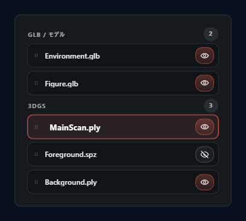
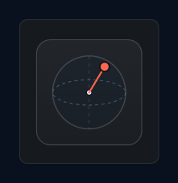

# シーンアセット

CAMERA_FRAMES のシーンは **スプラット**（Gaussian splatting）と **model**（glTF / glb）の 2 種類のアセットで構成されます。各アセットは インスペクター の Scene タブで一覧・編集できます。

## 1. シーンマネージャー セクション

インスペクター の Scene タブ内、最上部のセクション。

アセットは **種類ごとに分かれて**表示されます。表示順は固定で `model` → `スプラット` の順。各セクションにヘッダー（種類名 + 個数のバッジ）が付きます。

### 1.1 アセットの追加

追加の入口は次の通り。

- **ファイルダイアログ** — ツールレール の `Open Files...`（`Ctrl+O`）
- **Drag & Drop** — ビューポート に直接ファイルをドロップ
- **Remote URL** — ツールレール の URL 入力欄に `http://` / `https://` を貼って Load
- **Package expansion** — `.ssproj` / `.spz` / `.zip` を開くとアセットが展開される

同時に最大 3 つのアセットを並行してロードします。Import フェーズは `verify → expand → load → apply` の 4 段階で、進捗は Progress overlay に表示されます。

### 1.2 選択する

| 操作 | 効果 |
|---|---|
| クリック | そのアセットを単独選択（再クリックで解除） |
| `Ctrl` / `Meta` + クリック | 加算選択（toggle） |
| `Shift` + クリック | 範囲選択（アンカー からの範囲） |

アセット選択は **シーンマネージャー 側でもシーン（ビューポート）側でも同期**されます。ビューポート 上で スプラット を 選択ツールでクリックすると、シーンマネージャー 側もハイライトされます。

### 1.3 表示切替（Eye アイコン）

行右端の eye アイコン（{{icon:eye}} / {{icon:eye-off}}）で、アセット単位に表示を切替できます。アセットを選択せずに eye を押しても OK（選択に影響しない）。

表示オフにしたアセットは ビューポート / preview / 書き出し のすべてから消えます。

### 1.4 順序変更

#### ドラッグによる並び替え

行左の grip アイコンをドラッグして移動します。

- **同じ種類内でのみ並び替え可能**（スプラット を model セクションに入れたり、その逆はできない）
- drop 位置は行の上半分か下半分かで before / after を判定
- 複数選択時は同じ種類のアセット群を一括移動

#### ボタン

各行のコンテキストボタンで 1 段ずつ移動できます（上へ / 下へ）。

### 1.5 Label 編集

active アセット行をクリックすると、インライン編集に切り替わります。改行などは sanitize されます。

### 1.6 削除

複数選択した状態で `Delete` キー（ビューポート フォーカス時）、または シーンマネージャー のコンテキスト操作から削除します。削除は undo 可能。

### 1.7 複製

コンテキスト操作から **Duplicate** を実行。複製アセットは元アセットの直下（`sourceIndex + 1`）に挿入されます。ラベルには `Copy`, `Copy 2` のように unique な suffix が付きます。

complete スプラット編集 結果の source は複製にも引き継がれます（新アセットとして独立）。

## 2. オブジェクトプロパティ セクション

アセット選択時に展開されるプロパティセクション。複数選択時は **一括編集**として働きます。

### 2.1 Translate（位置）

| フィールド | step |
|---|---|
| X / Y / Z | 0.01 |

複数選択時は delta（変化量）が全選択アセットに適用されます。

### 2.2 Rotate（回転、degree）

| フィールド | 範囲 |
|---|---|
| X / Y / Z | −180〜180° |

内部では Euler order `XYZ` で degree で入出力されます。

### 2.3 Scale（World Scale）

- フィールド: 単一の倍率
- 制約: `0.01 ≤ worldScale`
- 意味: `asset.object.scale = baseScale × worldScale`（import 時点の scale を保ったまま後から倍率を掛ける）

複数選択時は掛け算（factor）が全アセットに適用されます。

### 2.4 Apply Transform

**Apply Transform** ボタンで、現在の wrapper の transform を content object に bake します。bake 後、wrapper は identity（無変形）に戻り、`baseScale` は `(1, 1, 1)` になります。

wrapper と content の 2 段階構造を 1 段に畳み込むことで、後続の操作が扱いやすくなります。

### 2.5 Content Transform

アセットは 2 段階の構造を持っています。

- **wrapper**（`asset.object`） — ユーザーが編集する外側の transform
- **content object** — 中身（スプラット の correction group、または GLB の root node）

Content transform は content object 側の transform であり、通常はユーザーは触らず、`Apply Transform` で bake される時のみ関わります。

### 2.6 baseScale / worldScale / unitMode

| 項目 | 意味 |
|---|---|
| **baseScale** | import 時点の asset.object.scale（固定値） |
| **worldScale** | 後から適用する倍率（ユーザー編集可能） |
| **unitMode** | アセットの想定単位（表示用ラベル） |

単位は種類ごとのデフォルトに基づきます。

### 2.7 書き出しロール

- **beauty** — 通常の 書き出し対象（デフォルト）
- **omit** — 書き出し時に別レイヤー / channel に分離（hidden 扱い）

PSD 書き出し時、omit されたアセットは layer に出つつ beauty 合成から外れます。

### 2.8 Mask Group

任意の文字列で複数アセットを論理的にグループ化する設定。書き出し時に同じ group をまとめて扱えます。空欄なら `—` と表示。

### 2.9 Working Pivot

変形ツールや ピボットツールで回転 / スケールの中心点として使う座標。

- **設定** — ピボットツール（`Q`）の gizmo をドラッグして world 座標を指定
- **reset** — 原点に戻す。origin と等しい pivot は `null` として扱われる

変換操作をするアセットによって、自然な pivot が異なる（例: 人物モデルなら足元、ビルなら底面中央）ので、ここを明示的に設定すると意図した回転が得られます。

## 3. Lighting セクション

シーン全体の照明を 1 つのモデルで制御します。

### 3.1 Direction Widget

132 × 132 px の円形ウィジェット。半径 46 px。中心のドラッグで方向（azimuth / elevation）を指定します。

- **azimuth** — 水平方向の角度（viewer から見た回転、`−180〜180°`）
- **elevation** — 俯仰角（`−89〜89°`）
- viewer から見た**相対角度**で表現されるため、ビューポート が回転すると widget の向きも相対的に追随する

### 3.2 光源の種類

- **Ambient** — 全体を包む拡散光（強度 `0〜2.5`、初期 `1.1`）
- **Model Light**（key light） — 方向光
  - **enabled** — ON / OFF（初期 ON）
  - **intensity** — `0〜3`、step `0.01`、初期 `2.0`
  - **azimuth / elevation** — 上記 widget で設定
- **Ambient fill** — key の反対方向からの補助光（自動）

### 3.3 リセット

「Reset Lighting」で default state（ambient 1.1、intensity 2.0、azimuth 36.87°、elevation 45°）に戻せます。

## 4. スプラット と model の違い

| | スプラット | model |
|---|---|---|
| **主なフォーマット** | `.ply` / `.spz` / `.splat` / `.kSplat` / `.sog` / `.rad` / `.zip` | `.glb` / `.gltf` |
| **構造** | SplatMesh（correction group 付き）| GLB scene / node |
| **スプラット編集** | 対応 | 非対応 |
| **書き出し** | 通常 / スプラット layers（PSD only） | 通常 / model layers（PSD only） |
| **Content object** | correction group | GLB の root node |

スプラット編集（`Shift+E`）は スプラット アセットに対してのみ有効で、model にはそもそも適用されません（別アセットとして扱うか、3D ツール側で編集してから再インポートしてください）。

## 5. 削除・複製と スプラット編集

- **削除** — 選択アセットを削除。undo 可能。関連する スプラット編集 state はクリア
- **複製** — 元の source から新アセットを clone して `sourceIndex + 1` に挿入。スプラット編集 の state は複製には引き継がれない（fresh copy）

スプラット編集 の Separate / Duplicate から作られた新アセットは、element の source の**直上**に挿入されます（スプラット編集 の章で詳述）。

## 6. 関連ショートカット

Scene アセット固有のショートカットは少なく、主に ビューポート 側の操作と連動します。

- `Delete` / `Backspace` — 選択アセットを削除
- 選択時の修飾キー（`Shift` / `Ctrl` / `Meta`）

全ショートカットは [キーボードショートカット一覧](11-shortcuts.md) を参照。

## 7. 関連章

- ビューポート での操作: [ビューポート とツール](08-viewport-tools.md)
- スプラット編集: [スプラット編集](09-per-splat-edit.md)
- 書き出し時の layer 扱い: [書き出し](10-export.md)
