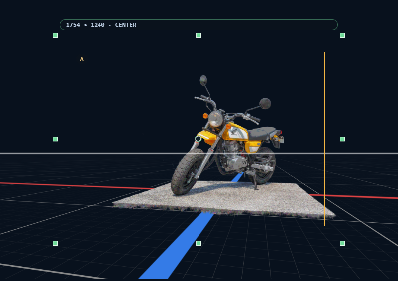

# ショットカメラ

CAMERA_FRAMES の **ショットカメラ** は、構図ごとに保存するカメラオブジェクトです。ビューポートの作業用カメラとは別物で、**構図を成立させる全情報**（位置・回転 / レンズ / 紙面サイズ / フレーム / 下絵の紐付け / 書き出し設定）を 1 つにまとめて保持します。

## 1. ショットカメラとは

- **複数持てる** — 1 プロジェクトに複数のショットカメラを作成・切替・並び替え・削除できる
- **構図ごとに独立** — 位置・回転 / レンズ / クリッピング / 用紙 / フレーム / フレームマスク / 下絵の紐付け / 書き出し設定をそれぞれ独立に保持
- **ビューポートのカメラとは別** — ビューポートで自由に視点を動かしてもショットカメラは変わらない。ショットカメラには意図的に保存した構図だけが残る
- **常に透視投影** — 正投影はビューポート側だけで、ショットカメラには昇格しない

ショットカメラの状態は `.ssproj` のプロジェクト文書に保存され、書き出しはショットカメラ単位で行われます。

## 2. カメラ一覧セクション

インスペクターのカメラタブにあります。

### 2.1 追加する

ボタン **[+]** で新規ショットカメラを追加。新規ショットカメラは独立した初期値で作られ、現在のビューポート視点がコピーされることはありません。

### 2.2 複製する

ボタン **[Duplicate]** でアクティブなショットカメラをまるごと複製します。位置・回転 / レンズ / フレーム / 用紙も含めてコピーされ、独立編集できます。

### 2.3 選択する

ショットカメラ一覧の行をクリックで切替。アクティブなショットカメラは常に 1 つ。

### 2.4 名前を変える

アクティブなショットカメラの行を再クリックすると、インライン編集になります（`Enter` で確定、`Esc` でキャンセル）。

### 2.5 削除する

ボタン **[Delete]** で選択ショットカメラを削除。ショットカメラが 1 つしかない時は削除できません（必ず 1 つ以上残ります）。

## 3. カメラプロパティセクション

アクティブなショットカメラのプロパティをここで編集します。

### 3.1 レンズ（焦点距離 / FOV）

- **Equivalent MM** — 35mm 換算の焦点距離（14〜200 mm、刻み 0.01）
- スライダーには標準レンズのスナップポイント: `14 / 18 / 21 / 24 / 28 / 35 / 50 / 70 / 75 / 85 / 100 / 135 / 200`
- 右側に対応する水平 FOV（度）がサマリ表示される

内部では水平 FOV（度）で持っており、Equivalent MM は表示用の換算値です（互いに変換されます）。

### 3.2 位置・回転

カメラの姿勢は位置と回転（クォータニオン）で構成されます。

**位置** — X / Y / Z の 3 軸、刻み `0.01`

**回転** — クォータニオンを Yaw / Pitch / Roll に分解して表示・編集

| フィールド | 範囲 | 意味 |
|---|---|---|
| Yaw（Y） | −180〜180° | 水平方向の首振り |
| Pitch（P） | −90〜90° | 俯仰角 |
| Roll（R） | −180〜180° | 前方軸周りの回転 |

刻みはすべて `0.01`。内部表現はクォータニオンですが、入力は Euler 角で行えます。

### 視点操作行

カメラプロパティセクションの位置・回転行にあります。

- **→ Copy ビューポート to Shot** — ビューポートの現在視点をアクティブなショットカメラに書き込む
- **← Copy Shot to ビューポート** — アクティブなショットカメラの視点をビューポートにコピー
- **↺ Reset Active View** — 視点をデフォルトに戻す

### 3.3 クリッピング（Near / Far）

| フィールド | 初期値 | 制約 |
|---|---|---|
| Near | 0.1 | `≥ 0.1`, 刻み `0.1` |
| Far | 1000 | `≥ Near + 0.01`, 刻み `0.1` |
| Auto Clipping | ON | ON 時は Near / Far 編集不可 |

`Auto Clipping` が ON の時、シーンの深度範囲から Near / Far が自動計算されます（Near は最近点 × 0.05 などの補正、Far は最遠点 × 1.15 の余白）。

### 3.4 ロールロック

回転行の右端にあるロックアイコン。

- **ON** — オービットでロールが変化しない（水平線が傾かない）。ロール自体はロール調整モードで変更可能
- **OFF** — オービットでロールも動く。自由度が高いが、水平線が傾きやすい

ショット構図を整える場面では ON が便利です。

### 3.5 ローカル移動グリッド

カメラ自身の軸を基準に、細かく視点をオフセットするボタン群。

| ボタン | 動き |
|---|---|
| ← / → | 水平（カメラ右方向の軸） |
| ↑ / ↓ | 垂直（カメラ上方向の軸） |
| ⟲ / ⟳ | 深度（カメラ前方軸） |

手動で位置 X/Y/Z を触るより構図が崩れにくいので、微調整に向きます。

## 4. カメラモードとビューポートモード

ビューポートの描画は 2 モード切替できます。

| | ビューポートモード | カメラモード |
|---|---|---|
| 視点 | エディタ用の作業カメラ | アクティブなショットカメラ |
| 操作 | オービット / パン / ドリーで自由 | ショットカメラ視点を直接動かす（ショットカメラに反映） |
| 正投影 | 切替可能（ビューポートのみ） | 常に透視投影 |
| 用紙枠 | 表示されない | **表示される** |
| フレームマスク | 表示されない | 設定に応じて表示 |
| 下絵 | プレビュー可 | プレビュー可・編集可 |

### 4.1 モードの意味

- **ビューポートモード** — シーンの様子を自由に見る作業視点
- **カメラモード** — 書き出しされる構図を**そのまま**見ている視点

どちらも同じシーンを描画しますが、**目的が違う**という位置付けです。

### 4.2 切替方法

- **パイメニュー**（中ボタンドラッグ）の **カメラ/ビューポート** 項目
- パイメニューの **レンズ調整** や **Clear Selection** なども同系列

ビューポートで正投影に切り替えたいときは、モード切替とは別に正投影トグルが必要です（正投影はビューポートのみ）。

## 5. 視点の直接操作

ビューポート / カメラモード共通で、次のマウス操作が使えます。

### 5.1 オービット / アンカーオービット

| 操作 | 動作 |
|---|---|
| 左ドラッグ | 注視点中心にオービット |
| `Ctrl +` 左ドラッグ または 右ドラッグ | ヒット点中心のアンカーオービット |

### 5.2 パン

- 右ボタンドラッグ

### 5.3 ドリー / ズーム

- マウスホイール
  - 透視投影モード: ドリー（前後移動）
  - 正投影モード: ズーム

### 5.4 精度モディファイア

| 修飾キー | オービット | ロール | レンズ |
|---|---|---|---|
| なし | 0.18 °/px | 0.18 °/px | 0.12 mm/px |
| `Shift` | 0.08 °/px | 0.08 °/px | 0.03 mm/px |
| `Alt` | 0.035 °/px | 0.035 °/px | —（効果なし） |
| `Alt + Shift` | 0.015 °/px | 0.015 °/px | — |

### 5.5 レンズ調整モード

パイメニュー の **レンズ調整** から入ります。

- マウスドラッグでレンズの焦点距離 / FOV をリアルタイム変更
- ビューポート上に mm / FOV の HUD が出る
- `Shift` で低感度
- **`Escape`** またはマウスリリースで終了

### 5.6 ロール調整モード

カメラモードでのみ有効。パイメニュー経由または内部コマンドから起動します。

- マウスドラッグでカメラのロール（前方軸周りの回転）を変更
- HUD にロール角（度）が出る
- `Shift` / `Alt` で精度調整
- **`Escape`** またはマウスリリースで終了
- ロールロックが ON でもロール調整は使用可能（オービット時だけロールが抑制される）

## 6. 書き出し名

書き出しタブの **書き出し設定** セクションにある **書き出し名** が、ショットごとの出力ファイル名の元になります。

- **テンプレート変数** `%cam` — ショットカメラの名前に置換される
- **デフォルト** `cf-%cam`
- テンプレートが空ならショット名そのもの
- 使えない文字（`\/:*?"<>|` と連続空白）は自動的に `-` に正規化される

ショットごとに異なる書き出し名を設定できます。重複したまま書き出しする場合の扱いは [書き出し](10-export.md) を参照。

## 7. 関連ショートカット

| キー | 動作 |
|---|---|
| `Escape` | レンズ / ロール調整モードを終了 |
| 修飾キー全般 | [キーボードショートカット一覧](11-shortcuts.md) 参照 |

## 8. 関連章

- 紙面サイズとフレーム: [用紙とフレーム](06-output-frame-and-frames.md)
- シーンアセット管理: [シーンアセット](04-scene-assets.md)
- 書き出し: [書き出し](10-export.md)
