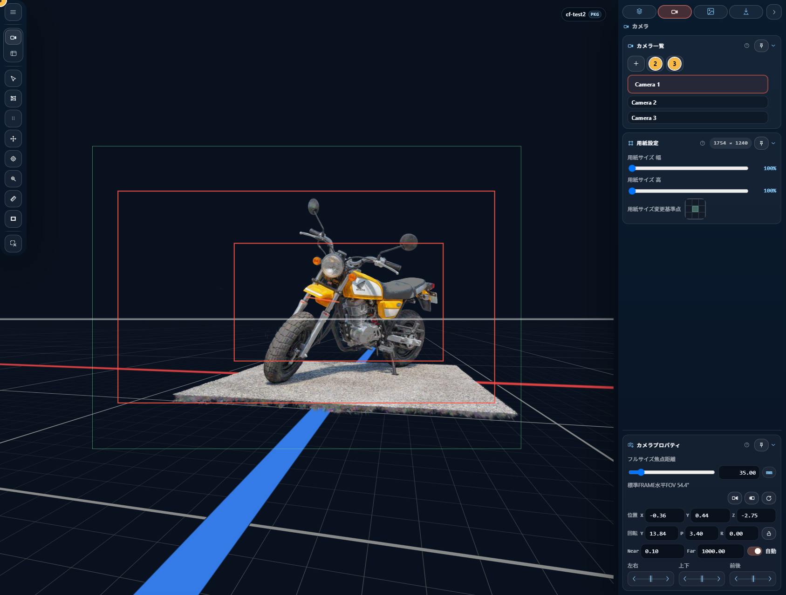
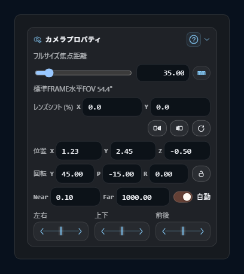

# Shot Camera

CAMERA_FRAMES の **shot camera** は、構図ごとに保存するカメラオブジェクトです。Viewport の作業用カメラとは別物で、**構図を成立させる全情報**（pose / lens / paper size / FRAME / reference image binding / export 設定）を 1 つにまとめて保持します。

## 1. Shot Camera とは

- **複数持てる** — 1 プロジェクトに複数の shot camera を作成・切替・並び替え・削除できる
- **構図ごとに独立** — pose / lens / clipping / output frame / frames / frame mask / reference images binding / export 設定をそれぞれ独立に保持
- **Viewport camera とは別** — Viewport で自由に視点を動かしても shot は変わらない。shot は意図的に保存した構図だけが残る
- **常に perspective** — orthographic は Viewport 側だけで、shot camera には昇格しない

shot camera の state は `.ssproj` の project document に保存され、export は shot 単位で行われます。

## 2. Shot Camera Manager セクション

Inspector の Camera タブにあります。

### 2.1 追加する

ボタン **[+]** で新規 shot camera を追加。新規 shot は独立した初期値で作られ、現在の Viewport 視点がコピーされることはありません。

### 2.2 複製する

ボタン **[Duplicate]** で active shot をまるごと複製します。pose / lens / frames / output frame も含めてコピーされ、独立編集できます。

### 2.3 選択する

shot 一覧の行をクリックで切替。active shot は常に 1 つ。

### 2.4 名前を変える

active shot の行を再クリックすると、インライン編集になります（Enter で確定、Esc でキャンセル）。

### 2.5 削除する

ボタン **[Delete]** で選択 shot を削除。shot が 1 つしかない時は削除できません（必ず 1 つ以上残ります）。

## 3. Shot Camera Properties セクション

active shot のプロパティをここで編集します。

### 3.1 Lens（焦点距離 / FOV）

- **Equivalent MM** — 35mm 換算の焦点距離（14〜200 mm、step 0.01）
- スライダーには標準レンズのスナップポイント: `14 / 18 / 21 / 24 / 28 / 35 / 50 / 70 / 75 / 85 / 100 / 135 / 200`
- 右側に対応する水平 FOV（度）がサマリ表示される

内部では水平 FOV（度）で持っており、Equivalent MM は表示用の換算値です（互いに変換されます）。

### 3.2 Pose（位置 / 回転）

Pose は position + 回転（quaternion）で構成されます。

**Position** — X / Y / Z の 3 軸、step `0.01`

**Rotation** — quaternion を Yaw / Pitch / Roll に分解して表示・編集

| フィールド | 範囲 | 意味 |
|---|---|---|
| Yaw（Y） | −180〜180° | 水平方向の首振り |
| Pitch（P） | −90〜90° | 俯仰角 |
| Roll（R） | −180〜180° | forward 軸周りの回転 |

step はすべて `0.01`。内部表現は quaternion ですが、入力は Euler で行えます。

### Pose action row

Shot Camera Properties セクションの pose 行にあります。

- **→ Copy Viewport to Shot** — Viewport の現在視点を active shot に書き込む
- **← Copy Shot to Viewport** — active shot の視点を Viewport にコピー
- **↺ Reset Active View** — 視点をデフォルトに戻す

### 3.3 Clipping（Near / Far）

| フィールド | 初期値 | 制約 |
|---|---|---|
| Near | 0.1 | `≥ 0.1`, step `0.1` |
| Far | 1000 | `≥ Near + 0.01`, step `0.1` |
| Auto Clipping | ON | ON 時は Near / Far 編集不可 |

Auto Clipping が ON の時、scene の depth 範囲から Near / Far が自動計算されます（Near は最近点 × 0.05 などの補正、Far は最遠点 × 1.15 のパディング）。

### 3.4 Roll Lock

rotation 行の右端にあるロックアイコン。

- **ON** — orbit で roll が変化しない（水平線が傾かない）。roll 自体は Adjust Roll モードで変更可能
- **OFF** — orbit で roll も動く。自由度が高いが、水平線が傾きやすい

shot layout を整える場面では ON が便利です。

### 3.5 Local Movement Grid

camera 自身の軸を基準に、細かく視点をオフセットするボタン群。

| ボタン | 動き |
|---|---|
| ← / → | 水平（camera right 軸） |
| ↑ / ↓ | 垂直（camera up 軸） |
| ⟲ / ⟳ | 深度（camera forward 軸） |

手動で Position X/Y/Z を触るより構図が崩れにくいので、微調整に向きます。

## 4. Camera Mode と Viewport Mode

Viewport の描画は 2 モード切替できます。

| | Viewport mode | Camera mode |
|---|---|---|
| 視点 | editor 用の作業カメラ | active shot camera |
| 操作 | orbit / pan / dolly で自由 | shot camera 視点を直接動かす（shot に反映） |
| orthographic | 切替可能（viewport-only） | 常に perspective |
| Render box | 表示されない | **表示される**（paper サイズ枠） |
| Frame mask | 表示されない | 設定に応じて表示 |
| Reference image | preview 可 | preview 可・編集可 |

### 4.1 モードの意味

- **Viewport mode** — シーンの様子を自由に見る作業視点
- **Camera mode** — export される構図を**そのまま**見ている視点

どちらも同じシーンを描画しますが、**目的が違う**という位置付けです。

### 4.2 切替方法

- **Pie menu**（中ボタンドラッグ）の **Camera/Viewport** 項目
- Pie menu の **Adjust Lens** や **Clear Selection** なども同系列

Viewport で orthographic に切り替えたいときは、モード切替とは別に orthographic toggle が必要です（orthographic は viewport-only）。

## 5. 視点の直接操作

Viewport / Camera mode 共通で、次のマウス操作が使えます。

### 5.1 Orbit / Anchor Orbit

| 操作 | 動作 |
|---|---|
| 左ドラッグ | 注視点中心に orbit |
| `Ctrl +` 左ドラッグ または 右ドラッグ | ヒット点中心のアンカーオービット |

### 5.2 Pan

- 右ボタンドラッグ

### 5.3 Dolly / Zoom

- マウスホイール
  - Perspective mode: dolly（前後移動）
  - Orthographic mode: zoom

### 5.4 精度モディファイア

| 修飾キー | Orbit | Roll | Lens |
|---|---|---|---|
| なし | 0.18 °/px | 0.18 °/px | 0.12 mm/px |
| `Shift` | 0.08 °/px | 0.08 °/px | 0.03 mm/px |
| `Alt` | 0.035 °/px | 0.035 °/px | —（効果なし） |
| `Alt + Shift` | 0.015 °/px | 0.015 °/px | — |

### 5.5 Adjust Lens モード

Pie menu の **Adjust Lens** から入ります。

- マウスドラッグで lens の焦点距離 / FOV をリアルタイム変更
- Viewport 上に mm / FOV の HUD が出る
- `Shift` で低感度
- **`Escape`** または マウスリリース で終了

### 5.6 Adjust Roll モード

Camera mode でのみ有効。pie menu 経由または内部コマンドから起動します。

- マウスドラッグで camera の roll（forward 軸周りの回転）を変更
- HUD に roll 角（度）が出る
- `Shift` / `Alt` で精度調整
- **`Escape`** または マウスリリース で終了
- Roll Lock が ON でも Adjust Roll は使用可能（orbit 時だけ roll が抑制される）

## 6. Export Name

Export タブの **Export Settings** セクションにある **Export Name** が、shot ごとの出力ファイル名の元になります。

- **テンプレート変数** `%cam` — shot camera の名前に置換される
- **デフォルト** `cf-%cam`
- テンプレートが空なら shot 名そのもの
- 使えない文字（`\/:*?"<>|` と連続空白）は自動的に `-` に正規化される

shot ごとに異なる Export Name を設定できます。重複したまま export する場合の扱いは [Export](10-export.md) を参照。

## 7. 関連ショートカット

| キー | 動作 |
|---|---|
| `Escape` | Lens / Roll adjust モードを終了 |
| 修飾キー全般 | [キーボードショートカット一覧](11-shortcuts.md) 参照 |

## 8. 関連章

- 紙面サイズと FRAME: [Output Frame と FRAME](06-output-frame-and-frames.md)
- シーンアセット管理: [シーンアセット](04-scene-assets.md)
- 書き出し: [Export](10-export.md)
