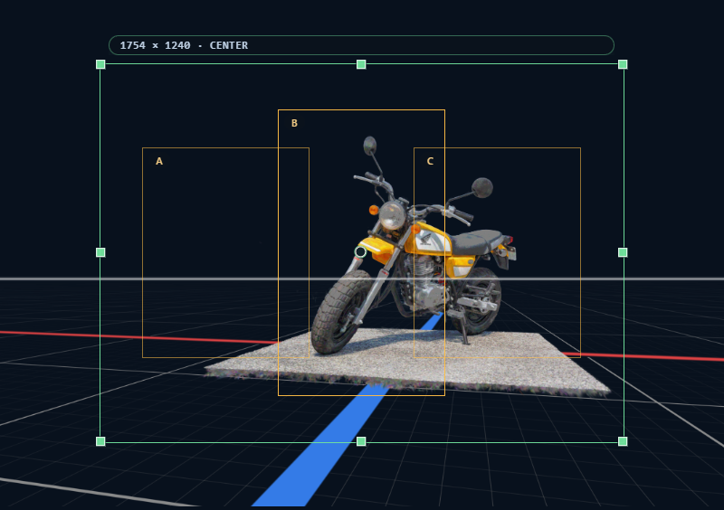
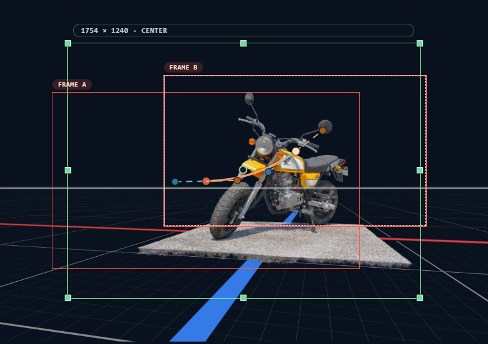

# 用紙とフレーム

CAMERA_FRAMES の構図は、**用紙**（紙面そのもの）と **フレーム**（アニメ撮影で言う撮影フレーム）の 2 つで成り立ちます。

- **用紙** — そのまま書き出しの出力領域となる「紙面サイズ」
- **フレーム** — アニメの撮影指示で使う**撮影フレーム**。紙面内のどこを撮るかを矩形で示す。1 つだけ置けば静止カットの構図、複数置けば開始 → 終了までの**カメラワーク**（パン・TU/TB・ズーム・その複合）を示す指示になる

## 1. 全体像

カメラモードではビューポート上に**紙面枠（用紙枠）**が表示され、その内部にフレーム群が重なります。

1. **リサイズハンドル（8 方向）** — 紙面サイズの変更
2. **パンエッジ（4 辺）** — 紙面中心の平行移動
3. **アンカー点** — 紙面上のアンカー位置
4. **メタラベル** — 出力解像度（px）とアンカーの表示

## 2. 用紙

インスペクターのカメラタブにある **用紙** セクションで設定します。

### 2.1 紙面サイズ（幅 / 高さ）

| 項目 | 値 |
|---|---|
| **基準サイズ** | 1754 × 1240 px |
| **下限** | 100%（＝ 基準そのまま） |
| **上限** | 幅 912% / 高さ 1290%（どちらも 16000 px 相当） |
| **刻み** | 1% |

出力実サイズはメタラベルに `3508 × 2480` のような px で表示されます。

### 2.2 アンカー（3×3）

紙面内の 9 点のうちどこを基準にするかを指定します。アンカーは **紙面サイズ変更時の固定点**としても使われます。

| | 左 | 中央 | 右 |
|---|---|---|---|
| **上** | top-left | top-center | top-right |
| **中央** | middle-left | center | middle-right |
| **下** | bottom-left | bottom-center | bottom-right |

UI は 3×3 のボタングリッドで、クリックで選択できます。

### 2.3 構図維持の投影

CAMERA_FRAMES の中心機能のひとつ。

**アンカーと中心点を固定したまま紙面サイズだけ変えられる**。これにより、構図を壊さずに出力領域の形（A4 縦 / 横、A3、正方形…）を切り替えられます。

例: 人物の頭頂（アンカー = `top-center`）を紙面上部に固定したまま、紙の高さだけ伸ばす。「頭は紙面上部から 5% の位置」という構図は保たれ、体の見切れ範囲だけが変わります。

### 2.4 表示ズーム

紙面枠をビューポート内でどれくらいの大きさで見るかの設定（表示倍率）。

- 範囲: 20% 〜 200%
- 表示の見やすさ調整のみで、出力解像度には影響しない

### 2.5 用紙枠の直接操作

用紙枠上で直接マウス操作できます。

| 操作 | 効果 |
|---|---|
| **8 リサイズハンドル** | 各辺 / 各角をドラッグして紙面サイズを変更（アンカー固定） |
| **4 パンエッジ** | 各辺中央をドラッグして紙面中心を平行移動 |
| **アンカー点** | 現在のアンカー位置を視覚化（表示のみ） |

## 3. フレーム

**フレーム** は、アニメ撮影の指示で使う**撮影フレーム**そのものです。紙面内に矩形を置いて「ここを撮る」を指示します。

- **1 つだけ** → 静止カットの構図
- **複数** → 最初のフレーム → 最後のフレームに向かって**カメラを動かす指示**（パン・TU/TB・ズーム・その複合）

複数フレームを順番に並べた時の中心の軌跡が [軌道](#5-軌道) で、それが撮影カメラワークの経路になります。

### 3.1 フレームを追加する

次のいずれかから追加できます。

- パイメニューの **New Frame**
- ツールレールの **New Frame** ボタン
- フレームセクションの **[+]** ボタン

上限は 1 ショットカメラあたり **20 個**。

### 3.2 選択する

| 操作 | 効果 |
|---|---|
| 枠内をクリック | 単独選択 |
| `Shift` / `Ctrl` / `Meta` + クリック | 加算（切替） |
| 空きスペースをクリック | 選択解除 |
| `Ctrl+D` | 選択クリア |

### 3.3 移動・回転・リサイズ・アンカー 編集

| 操作 | UI |
|---|---|
| **移動** | 枠内ドラッグ |
| **回転** | 枠外周の回転ゾーンをドラッグ。15° スナップ |
| **リサイズ** | 8 つのリサイズハンドル（四隅 + 各辺中央）。`Alt` でフレーム自身のアンカーをピボットにする |
| **アンカー編集** | フレーム上のアンカー点をドラッグ |

複数選択時は 1 つの操作が全選択フレームに一括適用されます（相対位置を保ったまま移動・リサイズ・回転）。

スケールの範囲は `0.1 〜 4.0`。

### 3.4 削除・複製

フレームセクションの **Duplicate** / **Delete** ボタン、または複数選択状態で操作します。軌道の保存済みノードも同時にコピー / 削除されます。

### 3.5 メタ情報

| フィールド | 内容 |
|---|---|
| **名前** | 表示ラベル。未設定なら `Frame 1` のような番号付きデフォルト |
| **x / y** | 紙面上の正規化座標（0〜1） |
| **スケール** | 基準サイズに対するスケール |
| **回転** | 回転角（度） |
| **アンカー** | フレーム自身のアンカー（リサイズのピボット） |

## 4. フレームマスク

フレームの外側を暗くするマスク機能。撮影フレーム外を視覚的に落として、紙面のどこを撮っているか（あるいはどこをカメラワークで通過するか）を見やすくするための補助です。

### 4.1 モード（off / all / selected）

| モード | 効果 |
|---|---|
| `off` | マスク無し |
| `all` | 全フレームの外側をマスク |
| `selected` | 選択フレームの外側だけマスク |

切替は次のいずれから。

- キーボード: `F`（all）/ `Shift+F`（selected）
- パイメニュー: **フレームマスク切替**
- フレームセクション: マスクボタン

### 4.2 不透明度

マスクの不透明度（0〜100%、刻み 1）。フレームセクションでスクラブ入力。

### 4.3 形状（範囲 / 軌道）

マスク領域の形状。

- **範囲**（`bounds`） — フレーム矩形の外側をそのままマスク
- **軌道** — フレーム群の軌道に沿ったエリア（掃引領域）の外側をマスク

### 4.4 1 → 2 フレーム遷移時の自動昇格

フレーム数が 1 から 2 以上に増えた瞬間、自動で次が実行されます。

- 形状が `bounds` なら **`trajectory`（軌道）に昇格**
- `trajectoryExportSource` が `none` なら、軌道外縁で描ける四隅を優先（`TL → TR → BR → BL`）、該当なしなら `center` を自動設定

読み込み時には自動昇格しません（保存時の形状が再現されます）。

## 5. 軌道

フレーム群の中心を繋ぐ経路。形状 = `trajectory` のマスクにも、書き出し時の軌道線にも使われます。

### 5.1 軌道モード（直線 / スプライン）

- **直線**（`line`） — フレーム中心を直線で結ぶ
- **スプライン**（`spline`） — 3 次ベジェで滑らかに接続。各フレームの接点にハンドルがある

### 5.2 スプラインノードモード

スプラインモード時の各フレームのノードモード。

| モード | 動作 |
|---|---|
| `auto` | ハンドルを自動計算（前後フレームとの角度・距離を考慮） |
| `corner` | ハンドルなし。直線 ↔ 直線の折れ曲がり |
| `mirrored` | 入り / 出のハンドルが常に対称（長さも方向も） |
| `free` | 入り / 出を独立に操作 |

### 5.3 軌道編集トグル

フレームセクションの **軌道編集** トグル。

- **ON** — ビューポート上に軌道ハンドルが表示され、直接ドラッグ編集できる
- **OFF** — ハンドル非表示

この ON/OFF はセッション中だけ保持され、プロジェクトには保存されません。

### 5.4 ハンドルのドラッグ

軌道編集中、各フレームの入りハンドル / 出ハンドルをドラッグで動かせます。

- ハンドルの座標は **フレーム中心基準の相対ベクトル**で保存される
- そのため、紙面サイズやフレーム位置が変わってもハンドルはフレームに追従して正しく再配置される

### 5.5 ノードを自動に戻す

アクティブなフレームのノードモードを `auto` に戻します（保存されたハンドル位置を捨てて、自動計算ベースに戻す）。

## 6. 用紙のリサイズと再マッピング

紙面サイズを変更した時、次が自動で再計算されます。

| 項目 | 扱い |
|---|---|
| 用紙アンカーのワールド座標 | **固定**（リサイズのピボット） |
| フレーム中心 / アンカー（紙面内座標） | 新しい用紙上の対応位置に再マッピング |
| 保存された軌道ノードのベクトル | フレーム中心基準のままなので、自動で正しい位置へ |
| 用紙の寸法 | 変更される |
| 各フレームのノードモード | 維持される |

つまり、紙面サイズを触っても **構図・フレーム配置・軌道の視覚的な同一性**が保たれます。

## 7. PSD 軌道レイヤー

書き出しタブの書き出し設定で、PSD 書き出し時に軌道を別レイヤーに含めるかを指定できます。

### 起点

| 設定 | 効果 |
|---|---|
| `none` | 軌道レイヤーを出力しない |
| `center` | 各フレーム中心を起点に軌道線 |
| `top-left` / `top-right` / `bottom-right` / `bottom-left` | 各フレームの該当角を起点に軌道線 |

### 目盛り

軌道レイヤーが有効なとき、各フレームの起点位置に**軌道線と直交する目盛り**が同じレイヤーに描かれます。前後フレームとの間隔・角度が視覚的に確認できます。

## 8. 関連ショートカット

| キー | 動作 |
|---|---|
| `F` | フレームマスク（all）を切替 |
| `Shift+F` | フレームマスク（selected）を切替 |
| `Alt` + リサイズハンドル ドラッグ | フレーム自身のアンカーをピボットにリサイズ |

## 9. 関連章

- カメラモードとセクションの関係: [ショットカメラ](05-shot-camera.md)
- 紙面への下絵: [下絵](07-reference-images.md)
- 書き出し時のフレーム / 軌道の扱い: [書き出し](10-export.md)
