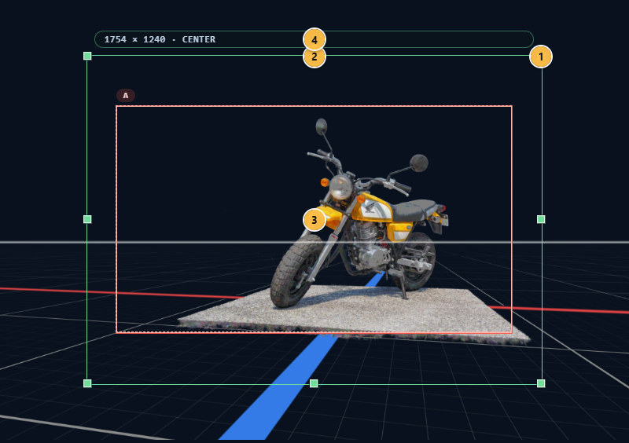

# 用紙 と フレーム

CAMERA_FRAMES の構図は、**用紙**（紙面そのもの）と **フレーム**（アニメ撮影で言う撮影フレーム）の 2 つで成り立ちます。

- **用紙** — そのまま 書き出し の出力領域となる「紙面サイズ」
- **フレーム** — アニメの撮影指示で使う**撮影フレーム**。紙面内のどこを撮るかを矩形で示す。1 つだけ置けば静止カットの構図、複数置けば開始 → 終了までの**カメラワーク**（パン・TU/TB・ズーム・その複合）を示す指示になる

## 1. 全体像

カメラモード では ビューポート 上に**紙面枠（用紙枠）**が表示され、その内部に フレーム 群が重なります。

1. **リサイズハンドル（8 方向）** — 紙面サイズの変更
2. **パンエッジ（4 辺）** — 紙面中心の平行移動
3. **アンカー dot** — 紙面上の アンカー 点
4. **Meta ラベル** — 出力解像度（px）と アンカー の表示

## 2. 用紙

インスペクター の Camera タブにある **用紙** セクションで設定します。

### 2.1 紙面サイズ（Width / Height）

| 項目 | 値 |
|---|---|
| **基準サイズ** | 1754 × 1240 px |
| **下限** | 100%（＝ 基準そのまま） |
| **上限** | 幅 912% / 高さ 1290%（どちらも 16000 px 相当） |
| **step** | 1% |

出力実サイズは Meta ラベルに `3508 × 2480` のような px で表示されます。

### 2.2 アンカー（3×3）

紙面内の 9 点のうちどこを基準にするかを指定します。アンカー は **紙面サイズ 変更時の固定点**としても使われます。

| | Left | Center | Right |
|---|---|---|---|
| **Top** | top-left | top-center | top-right |
| **Middle** | middle-left | center | middle-right |
| **Bottom** | bottom-left | bottom-center | bottom-right |

UI は 3×3 のボタングリッドで、クリックで選択できます。

### 2.3 Custom Frustum（構図維持の仕組み）

CAMERA_FRAMES の中心機能のひとつ。

**アンカー と中心点（center）を固定したまま 紙面サイズ だけ変えられる**。これにより、構図を壊さずに出力領域の形（A4 縦 / 横、A3、正方形…）を切り替えられます。

例: 人物の頭頂（アンカー = top-center）を紙面上部に固定したまま、紙の高さだけ伸ばす。「頭は紙面上部から 5% の位置」という構図は保たれ、体の見切れ範囲だけが変わります。

### 2.4 表示ズーム

紙面枠を ビューポート 内でどれくらいの大きさで見るかの設定（表示倍率）。

- 範囲: 20% 〜 200%
- 表示の見やすさ調整のみで、出力解像度には影響しない

### 2.5 用紙枠 の直接操作

Render box 上で直接マウス操作できます。

| 操作 | 効果 |
|---|---|
| **8 リサイズハンドル** | 各辺 / 各角をドラッグして 紙面サイズ を変更（アンカー 固定） |
| **4 パンエッジ** | 各辺中央をドラッグして紙面中心を平行移動 |
| **アンカー dot** | 現在の アンカー 位置を視覚化（表示のみ） |

## 3. フレーム

**フレーム** は、アニメ撮影の指示で使う**撮影フレーム**そのものです。紙面内に矩形を置いて「ここを撮る」を指示します。

- **1 つだけ** → 静止カットの構図
- **複数** → 最初のフレーム → 最後のフレームに向かって**カメラを動かす指示**（パン・TU/TB・ズーム・その複合）

複数フレームを順番に並べた時の中心の軌跡が [軌道](#5-軌道) で、それが撮影カメラワークの経路になります。

### 3.1 フレーム を追加する

次のいずれかから追加できます。

- パイメニュー の **New Frame**
- ツールレール の **New Frame** ボタン
- フレーム セクションの **[+]** ボタン

上限は 1 ショットカメラ あたり **20 個**。

### 3.2 選択する

| 操作 | 効果 |
|---|---|
| 枠内をクリック | 単独選択 |
| `Shift` / `Ctrl` / `Meta` + クリック | 加算（toggle） |
| 空きスペースをクリック | 選択解除 |
| `Ctrl+D` | 選択クリア |

### 3.3 移動・回転・リサイズ・アンカー 編集

| 操作 | UI |
|---|---|
| **移動** | 枠内ドラッグ |
| **回転** | 枠外周の rotation zone をドラッグ。snap 15° |
| **リサイズ** | 8 つの resize handle（四隅 + 各辺中央）。`Alt` で フレーム 自身の アンカー を pivot にする |
| **アンカー 編集** | frame 上の アンカー dot をドラッグ |

multi-selection 時は 1 つの操作が全選択 フレーム に一括適用されます（相対位置を保ったまま移動・リサイズ・回転）。

scale の clamp は `0.1 〜 4.0`。

### 3.4 削除・複製

フレーム セクションの **Duplicate** / **Delete** ボタン、または multi-select した状態で操作します。軌道 の stored node も同時にコピー / 削除されます。

### 3.5 メタ情報

| フィールド | 内容 |
|---|---|
| **name** | 表示ラベル。未設定なら `Frame 1` のような番号付きデフォルト |
| **x / y** | 紙面上の正規化座標（0〜1） |
| **scale** | 基準サイズに対するスケール |
| **rotation** | 回転角（度） |
| **アンカー** | フレーム 自身の アンカー（リサイズの pivot） |

## 4. フレームマスク

フレーム の外側を暗くするマスク機能。撮影フレーム外を視覚的に落として、紙面のどこを撮っているか（あるいはどこをカメラワークで通過するか）を見やすくするための補助です。

### 4.1 Mode（off / all / selected）

| mode | 効果 |
|---|---|
| `off` | マスク無し |
| `all` | 全 フレーム の外側をマスク |
| `selected` | 選択 フレーム の外側だけマスク |

切替は次のいずれから。

- キーボード: `F`（all）/ `Shift+F`（selected）
- パイメニュー: **フレームマスク切替**
- フレーム セクション: mask ボタン

### 4.2 Opacity

マスクの不透明度（0〜100%、step 1）。フレーム セクションでスクラブ入力。

### 4.3 Shape（bounds / 軌道）

マスク領域の形状。

- **bounds** — フレーム 矩形の外側をそのままマスク
- **軌道** — フレーム 群の軌道に沿ったエリア（sweep area）の外側をマスク

### 4.4 1 → 2 フレーム 遷移時の自動昇格

フレーム 数が 1 から 2 以上に増えた瞬間、自動で次が実行されます。

- shape が `bounds` なら **`trajectory` に昇格**
- `trajectoryExportSource` が `none` なら、軌道外縁で描ける四隅を優先（`TL → TR → BR → BL`）、該当なしなら `center` を自動設定

load 時には自動昇格しません（保存時の shape が再現されます）。

## 5. 軌道

フレーム 群の中心を繋ぐ path。shape = `trajectory` の mask にも、書き出し時の軌道線にも使われます。

### 5.1 軌道 Mode（line / spline）

- **line** — フレーム center を直線で結ぶ
- **spline** — cubic Bézier で滑らかに接続。各 フレーム の接点に handle がある

### 5.2 Spline Node Mode（auto / corner / mirrored / free）

spline モード時の各 フレーム のノードモード。

| mode | 動作 |
|---|---|
| `auto` | handle を自動計算（前後 フレーム との角度・距離を考慮） |
| `corner` | handle 無し。直線 ↔ 直線の折れ曲がり |
| `mirrored` | in / out の handle が常に対称（長さも方向も） |
| `free` | in / out を独立に操作 |

### 5.3 軌道編集トグル

フレーム セクションの **軌道編集** トグル。

- **ON** — ビューポート 上に 軌道 handle が表示され、直接ドラッグ編集できる
- **OFF** — handle 非表示

この状態は runtime-only で、プロジェクトには保存されません。

### 5.4 Handle Drag

軌道 edit 中、各 フレーム の in handle / out handle をドラッグで動かせます。

- handle の座標は **フレーム中心 基準の相対ベクトル**で保存される
- そのため、紙面サイズ や フレーム 位置が変わっても handle は フレーム に追従して正しく再配置される

### 5.5 Reset Node to Auto

active フレーム のノードモードを `auto` に戻します（保存された handle 位置を捨てて、自動計算ベースに戻す）。

## 6. 用紙 のリサイズと Remap

紙面サイズ を変更した時、次が自動で再計算されます。

| 項目 | 扱い |
|---|---|
| 用紙 アンカー の world 点 | **固定**（リサイズの pivot） |
| フレーム center / アンカー（紙面内座標） | 新 paper 上の対応位置に remap |
| 保存された 軌道ノード vector | フレーム中心 基準のままなので、自動で正しい位置へ |
| 用紙 の dimensions | 変更される |
| 各 フレーム の node mode | 維持される |

つまり、紙面サイズ を触っても **構図・フレーム 配置・軌道の視覚的な同一性**が保たれます。

## 7. PSD 軌道 Layer

書き出し タブの 書き出し設定 で、PSD 書き出し時に 軌道 を別レイヤーに含めるかを指定できます。

### Source（起点）

| 設定 | 効果 |
|---|---|
| `none` | 軌道 layer を出力しない |
| `center` | 各 フレーム center を起点に 軌道 線 |
| `top-left` / `top-right` / `bottom-right` / `bottom-left` | 各 フレーム の該当 corner を起点に 軌道 線 |

### Tick Mark

軌道 layer が有効なとき、各 フレーム の起点位置に**軌道線と直交する tick mark**が同じレイヤーに描かれます。前後 フレーム との間隔・角度が視覚的に確認できます。

## 8. 関連ショートカット

| キー | 動作 |
|---|---|
| `F` | フレームマスク（all）を切替 |
| `Shift+F` | フレームマスク（selected）を切替 |
| `Alt` + resize handle ドラッグ | フレーム 自身の アンカー を pivot にリサイズ |

## 9. 関連章

- カメラモード とセクションの関係: [ショットカメラ](05-shot-camera.md)
- 紙面への下絵: [リファレンス画像](07-reference-images.md)
- 書き出し時の frame / 軌道 扱い: [書き出し](10-export.md)
