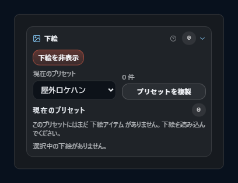
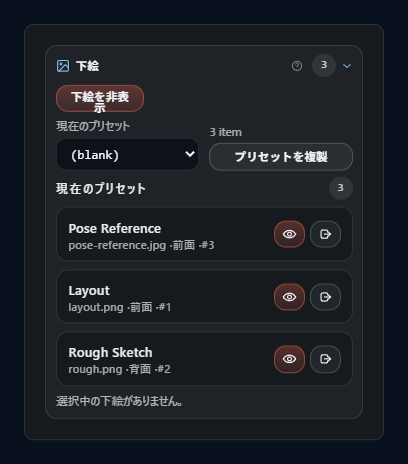
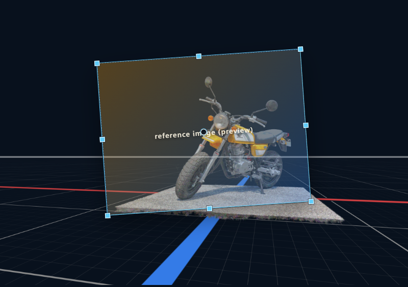

# 下絵

CAMERA_FRAMES の **下絵** は、カメラビュー上に重ねる画像です。紙面基準で位置・サイズを保持し、背面と前面のレイヤー分けに対応します。

## 1. 全体像（3 層の階層）

下絵は次の 3 階層で管理されます。

1. **プリセット** — 構図ごとに使い分ける下絵セット（1 プリセット = 複数アイテムのコンテナ）
2. **アイテム** — プリセット内の個別の画像
3. **ショットカメラ紐付け / 上書き** — ショットカメラがどのプリセットを使うか、アイテム単位の上書き

1 つのショットカメラは 1 つのプリセットを参照します。同じプリセットを複数のショットカメラで共有しても、ショットカメラごとにアイテムの位置や表示有無を上書きできます。

## 2. 下絵プリセットセクション

インスペクターの下絵タブ最上部。

### 2.1 `(blank)` プリセット

ID `reference-プリセット-blank`、名前 `(blank)` の**デフォルトプリセット**。常に存在し、削除できません。

意味:

- 下絵セットを使っていない状態を表す空プリセット
- 新規ショットカメラや下絵未設定のショットカメラは実質的に `(blank)` を参照する
- `(blank)` 選択中に読み込みした時は、新しいプリセットを作ってそこへ読み込み、`(blank)` 自体は汚さない

### 2.2 プリセットの操作

| 操作 | 効果 |
|---|---|
| **作成** | 新規プリセットを作成し、アクティブに切替、アクティブなショットカメラに紐付け |
| **切替** | アクティブなプリセットを変更。アクティブなショットカメラの紐付けも更新 |
| **複製** | アクティブなプリセットのアイテムと紙面基準サイズをコピーして新規プリセットを作成 |
| **削除** | `(blank)` 以外を削除可能。削除されたプリセット ID は全ショットカメラから自動で剥がされる |

### 2.3 ショットカメラへの紐付け

各ショットカメラは `referenceImages.プリセットId` を持ち、どのプリセットを使うかを記録します。

- ショットカメラに明示的なプリセット指定がなければ `(blank)` を返す
- プリセットを切替えると、アクティブなショットカメラの紐付けも同時に更新される

## 3. 下絵マネージャーセクション

アクティブなプリセットのアイテム一覧を編集するセクション。

### 3.1 アイテム一覧

アイテムは **背面** / **前面** の 2 グループに分けて表示されます。

- **背面** — シーンの後ろ（下絵として透かす用途）
- **前面** — シーンの前（重ね合わせ用途）

アイテムの表示順は背面 → 前面の順で描画されます（背面が下、前面が上）。

### 3.2 プレビュー表示と書き出し参加の独立切替

各アイテムは次の 2 つを**独立に**持ちます。

| フラグ | 効果 |
|---|---|
| **プレビュー表示** | ビューポート / カメラビューでの表示有無 |
| **書き出し参加** | 書き出し時のレイヤー参加有無 |

プレビューだけ表示して書き出しからは外す、あるいはその逆も可能です。

### 3.3 前面 / 背面の切替

各アイテムの `group` 値を変更することで前後を移動できます。移動先グループの末尾に配置されます。

### 3.4 順序（同じグループ内）

各アイテムは `order` 値を持ち、同一グループ内で並び替えができます。ドラッグ & ドロップで順序を変更すると、各グループの `order` が再計算されます。

### 3.5 読み込み

読み込みの入口は下絵マネージャーセクションの + ボタン、またはビューポートへのドラッグ & ドロップ。

#### 通常画像（PNG / JPG / WebP）

1 ファイル = 1 アイテムとして追加されます。

#### PSD

PSD は **子を持たないレイヤーを個別アイテムとして展開**します。

- 子を持たないレイヤーのみ抽出
- 各レイヤーの `visible` / `opacity` / 位置情報がアイテムの初期値に反映される
- PSD のレイヤー順がそのまま前面グループ末尾に追加される

### 3.6 `(blank)` で読み込んだとき

アクティブなプリセットが `(blank)` の状態で読み込みを実行すると、**新規プリセットが自動作成**され、そこに読み込まれます。

- プリセット名はファイル名またはショットカメラ名をヒントに生成
- `(blank)` 自体にはアイテムを加えない
- ショットカメラにも新プリセットが紐付けされる

## 4. 下絵プロパティセクション

選択アイテムの位置・回転・拡縮を編集。

### 4.1 単一アイテムの編集

| フィールド | 単位 | 初期値 | 範囲 |
|---|---|---|---|
| **不透明度** | 0〜1 | 1 | 0〜1 |
| **スケール** | % | 100% | 0.1〜100000% |
| **回転** | 度 | 0 | — |
| **オフセット** | px (x, y) | 0, 0 | — |
| **アンカー** | 正規化 (ax, ay) | 0.5, 0.5 | 0〜1 |

### 4.2 複数選択時の一括変換

複数選択時は、選択を囲む **論理選択枠**（左 / 上 / 幅 / 高さ / 回転 / アンカー）が自動生成され、以下の操作が選択範囲全体に一括適用されます。

- **移動** — ピボット中心に全アイテムを同量移動
- **回転** — 選択範囲のピボットを中心に全アイテムを回転
- **拡縮** — 選択範囲のピボットを中心にスケール

各アイテムの個別パラメータは、一括変換の結果で自動更新されます。

## 5. ショットカメラごとの下絵差分

同じプリセットを複数のショットカメラで共有しつつ、ショットカメラごとに下絵の位置や表示を調整できます。あるショットカメラでアイテムを動かすと、そのショットカメラに対する差分だけが記録され、他のショットカメラから見たときは元の位置のままです。差分をすべて元に戻すと、そのショットカメラからはまた共有プリセットと同じ状態に見えます。

プリセットやアイテムを削除した場合、全ショットカメラに残っていた該当プリセット / アイテムの差分も自動で片付けられます。

## 6. 紙面サイズが変わっても下絵位置が保たれる仕組み

各プリセットは、その下絵を最初にセットしたときの**紙面基準サイズ**（デフォルトは `1754 × 1240 px`）を覚えています。アイテムの位置は紙面基準サイズとアンカーを基準に保存されているので、**用紙のサイズやアンカーを後から変更しても、下絵は紙面基準の位置関係を保ったまま自動で再配置**されます。

ショットカメラごとに用紙のサイズやアンカーが違う場合のズレも、差分側の補正情報で自動調整されるので、ユーザーが手動で合わせ直す必要はありません。

## 7. ビューポート上での直接操作

### 7.1 編集モードに入る

| キー | 動作 |
|---|---|
| `Shift+R` | 下絵編集モードを切替 |
| `R` | 下絵プレビューの表示を切替（編集モードとは独立） |

編集モード中のみ、ビューポート上でアイテムのハンドル操作が有効になります。

### 7.2 ドラッグ操作

| 操作 | 効果 |
|---|---|
| 枠内ドラッグ | 移動（4 px 以上でドラッグ判定） |
| 四隅 / 辺中央のハンドル | リサイズ（`Alt` でアイテム自身のアンカーをピボットに） |
| 回転ゾーン（枠外周） | 回転（選択範囲のピボット中心） |
| アンカー点 | アンカー（ピボット点）の編集（単一選択時のみ） |

複数選択時は、選択範囲ごとまとめて変換します（相対位置を保つ）。

## 8. プレビューと書き出しの参加条件

### プレビュー参加条件

以下すべてが満たされた時のみビューポートで表示:

1. `R` キーで下絵プレビュー全体が ON になっている
2. そのアイテムの **プレビュー表示** トグルが ON
3. 画像ファイルが読み込めている

### 書き出し参加条件

以下すべてが満たされた時のみ書き出し出力に含まれる:

1. 書き出しセクションの **下絵を含める** が ON
2. そのアイテムの **書き出し参加** トグルが ON
3. 画像ファイルが読み込めている

### プレビューと書き出しの独立性

プレビューと書き出しは**独立した 2 つの切替系統**を持ちます。

- プレビュー: セッション単位（`R`）＋ アイテム単位（マネージャー）
- 書き出し: 書き出し実行単位（出力セクション）＋ アイテム単位（マネージャー）

例えば「プレビューしないが書き出しにだけ含める」「プレビューするが書き出しからは外す」も可能です。

## 9. 関連ショートカット

| キー | 動作 |
|---|---|
| `R` | 下絵プレビュー表示切替 |
| `Shift+R` | 下絵編集モード切替 |
| `Alt` + リサイズハンドル | アイテムのアンカーをピボットにリサイズ |

## 10. 関連章

- 紙面サイズとアンカー: [用紙とフレーム](06-output-frame-and-frames.md)
- ショットカメラとプリセットの紐付け: [ショットカメラ](05-shot-camera.md)
- 書き出しでのレイヤー参加: [書き出し](10-export.md)
