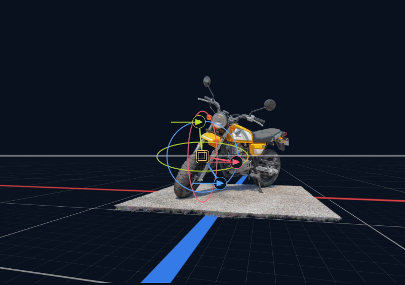
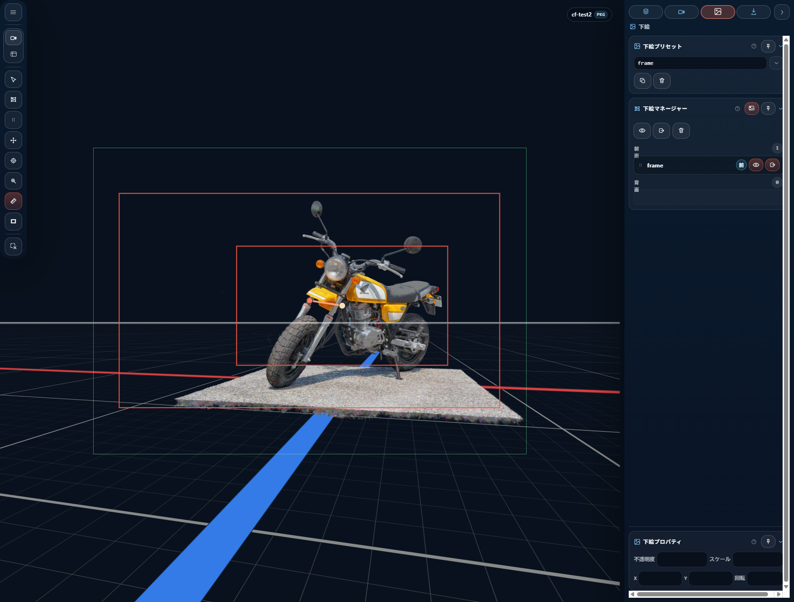
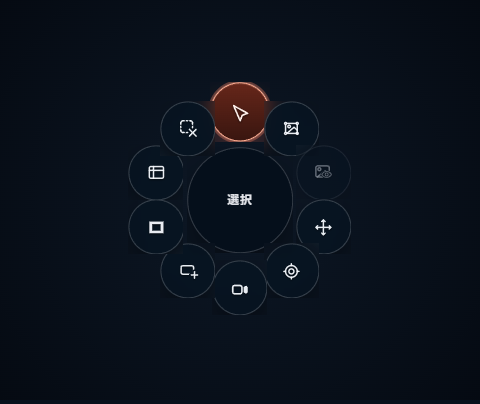
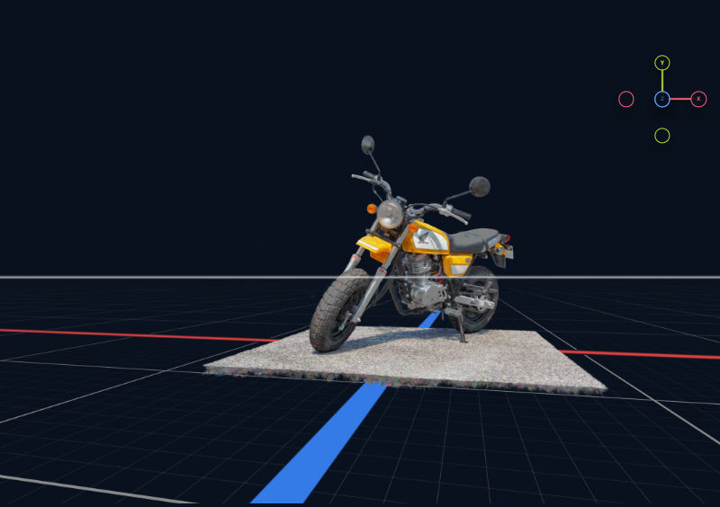

# ビューポート とツール

ビューポート での操作は、**Navigate**（デフォルト）と各種 Tool、そして **パイメニュー** で構成されます。ツールは相互排他で、常に 1 つだけが active になります。

## 1. ツール切替の仕組み

- **中央制御** — Input Router が全 pointer / keyboard イベントを受け、ツールモードに応じて interaction controller / ビューポート tool controller に分配する
- **Mode state** — `store.ビューポートToolMode.value` で現在のツールを管理（`"select"` / `"transform"` / `"pivot"` / `"reference"` / `"none"`）
- **相互排他** — 新しいツールに切替えると、前のツールは自動で終了する
- **Measurement** — `store.measurement.active.value` で独立管理される

## 2. Navigate（デフォルト）

ツールが何も選択されていない状態。シーンの視点操作に専念します。

### 2.1 Orbit（注視点中心の回転）

- **左ドラッグ** — 注視点（look pivot）を中心に orbit
- 感度: `0.18 °/px`（デフォルト）

### 2.2 アンカー Orbit（ヒット点中心の回転）

- **`Ctrl +` 左ドラッグ** または **右ドラッグ** — カーソルが指す 3D 点（hit）を中心に orbit
- スプラット編集 brush 中は右ドラッグも同等

### 2.3 Pan

- **右ボタンドラッグ**（Orthographic mode 限定）

### 2.4 Dolly / Zoom

- **マウスホイール**
  - Perspective: dolly（前後移動）
  - Orthographic: zoom
  - `Shift` でホイール時 depth offset、`Alt` で微調整モード（orthographic のみ）

### 2.5 精度モディファイア

orbit / roll / lens / zoom で共通:

| 修飾キー | 効果 |
|---|---|
| `Shift` | 低精度（orbit 0.08°/px、lens 0.03 mm/px） |
| `Alt` | 中精度（orbit 0.035°/px） |
| `Alt + Shift` | 最低精度（orbit 0.015°/px） |

## 3. Zoom Tool（`Z`）

画面中央を基準にドラッグで zoom する専用ツール。

- **ドラッグ** — 右で zoom in、左で zoom out（指数スケール）
- **感度** — 通常、`Shift` で低感度
- **モード終了** — `Escape` または再度 `Z` を押す

カメラモード では `表示ズーム`（表示倍率）を変更、ビューポートモード では lens FOV（焦点距離）を変更します。

## 4. Select Tool（`V`）

シーンアセットの選択専用ツール。

### 4.1 クリック選択

- シーンアセットにレイキャストでヒット判定
- 最初にヒットしたアセットを選択
- 非表示のアセットはスキップ

### 4.2 修飾キーによる加算選択

| 修飾キー | 効果 |
|---|---|
| なし | 単独選択（置換） |
| `Shift` / `Ctrl` / `Meta` | 加算選択（toggle） |

シーンマネージャー 側の選択と同期します。

## 5. Transform Tool（`T`）

選択アセットの移動 / 回転 / スケール用の gizmo を表示します。

### 5.1 Gizmo の構成

| 要素 | 動作 |
|---|---|
| **Move axes**（X / Y / Z の直線） | 軸方向にドラッグして移動 |
| **Move planes**（XY / YZ / ZX の平面） | 平面上をドラッグして移動 |
| **Rotate rings**（X / Y / Z、前後 2 分割） | 回転リングをドラッグして回転 |
| **Scale handle**（uniform） | ドラッグして均等スケール |

### 5.2 Transform Space

`local` / `world` の 2 つの basis を切り替えられます。

- **local** — アセット自身の quaternion に基づく軸
- **world** — world 軸 `(1,0,0)` / `(0,1,0)` / `(0,0,1)`

### 5.3 Multi-selection

複数選択時、pivot を中心に全アセットが一括で変換されます（相対位置を保持）。

## 6. Pivot Tool（`Q`）

シーンアセットの **working pivot**（変形ツールでの pivot point）を編集するツール。

- 変形ツールと同じ gizmo を表示するが、**移動ハンドルのみ**有効（回転・スケールは非表示）
- gizmo をドラッグして pivot を world 座標で指定
- pivot の reset は シーンマネージャー 側の操作から

working pivot が `null`（origin 相当）なら、アセットの object position がデフォルトの pivot になります。

## 7. Reference Edit Tool（`Shift+R`）

下絵 を編集するモード。詳しくは [リファレンス画像](07-reference-images.md) を参照。

概要:

- `Shift+R` で toggle
- モード中は ビューポート 上の reference item が編集対象に
- drag / resize handle / rotation zone / アンカー で直接操作

## 8. Measurement Tool（`M`）

2 点の距離を測り、入力値でシーン全体をスケールするツール。

### 8.1 使い方

1. `M` で 測定モードに入る
2. シーン上の 1 点目をクリック（orange 表示）
3. 2 点目をクリック（light blue 表示）
4. 下部の chip に現在の距離が出る
5. chip の入力欄に「この 2 点を X メートルにしたい」と数値を入れて Enter
6. 選択アセットが倍率でスケールされる

### 8.2 条件

Enter による scale 適用は、次が全て満たされる時のみ有効:

- 2 点ともセットされている
- アセットが選択されている
- 入力値が有限数かつ > 0

### 8.3 UI

- **Start point** — orange（`#ffb26d`）
- **End point** — light blue（`#7ddcff`）
- **Line** — 2 点を結ぶ線
- **Chip** — 画面下部の入力欄（現在距離表示 + 数値入力）

## 9. スプラット編集 Tool（`Shift+E`）

スプラット アセットの個別 スプラット を編集するモード。

- 入口: `Shift+E` / ツールレール / パイメニュー（ない場合あり）
- モード中は ビューポート 内に専用 toolbar が現れる

詳しい操作は [スプラット編集](09-per-splat-edit.md) を参照。

## 10. パイメニュー

中ボタン（middle click）ドラッグで展開する、10 項目のラジアルメニュー。

### 10.1 展開とメトリクス

- **トリガー** — 中ボタン押下で即展開（タッチは 320 ms ホールド）
- **半径** — radius 88 px、inner 28 px、outer 126 px
- **coarse pointer**（タッチ）— 1.28 倍に拡大

### 10.2 10 アクション（12 時方向起点、時計回り）

1. **Select**（{{icon:cursor}}）
2. **Reference**（{{icon:reference-tool}}）
3. **下絵表示切替**（{{icon:reference-preview-on}} / {{icon:reference-preview-off}}）
4. **Transform**（{{icon:move}}）
5. **Pivot**（{{icon:pivot}}）
6. **レンズ調整**（{{icon:camera-dslr}}）
7. **New Frame**（{{icon:frame-plus}}）
8. **フレームマスク切替**（{{icon:mask}}）
9. **カメラ/ビューポート**（{{icon:camera}} / {{icon:viewport}}）
10. **Clear Selection**（{{icon:selection-clear}}）

### 10.3 有効化条件

- **レンズ調整** — ビューポートモード で orthographic 時は無効
- **フレームマスク** 系 — カメラモード のみ
- **下絵表示切替** — 下絵 が存在する時のみ

### 10.4 選択と確定

- 開いた後、カーソルを項目の方向へ動かしてホバー
- 中ボタンを離すと、hover 中のアクションが確定
- 中心（inner radius 内）で離すと何も実行されない
- `Escape` でキャンセル

## 11. Middle-click / Pointer Routing

### Middle-click (button 1)

- パイメニュー を展開
- テキスト入力 / interactive target では無効

### 右ドラッグと `Ctrl+` 左ドラッグの同等性

- どちらも アンカー orbit のトリガー
- orthographic pan は右ドラッグのみ

### タッチデバイス

- 長押し（320 ms）で パイメニュー 展開
- 12 px 以上動くとキャンセル
- coarse pointer 検知で pie radius を自動拡大

## 12. Axis Gizmo（Orthographic 用）

orthographic モード時に画面隅に表示される軸表示ウィジェット。

- **X / Y / Z の正負両方**のボタン + 軸トグル
- 正方向ボタンクリック → `+X` / `+Y` / `+Z` ビューへ alignment
- 負方向ボタンクリック → `-X` / `-Y` / `-Z` ビューへ alignment
- 軸中心ボタンクリック → 同軸 / 反対軸の toggle

## 13. Transform Gizmo の hover 状態

gizmo のハンドルにホバーすると、

- `data-hovered-handle` / `data-hovered-axis` 属性が付与される
- CSS でハイライト表示

## 14. ツールレール の挙動

### 14.1 折りたたみ

インスペクター の折りたたみに連動して、ツールレール も省スペースモードに切り替わります。

### 14.2 ドラッグで移動

ツールレール カードの余白をドラッグすると、画面内で ツールレール 自体の位置を移動できます（`toolRailPosition`）。

### 14.3 Popover

- **Quick Menu** — モードに応じた ZoomView / レンズ調整 popover
- **レンズ HUD** — レンズ調整中、ビューポート 上に浮かぶ mm / FOV 表示
- **フレームマスク Popover** — フレームマスク mode（off / all / selected）の切替 popover

## 15. 関連ショートカット一覧

| キー | 動作 |
|---|---|
| `V` | 選択ツール toggle |
| `T` | 変形ツール toggle |
| `Q` | Pivot 編集モード toggle |
| `Z` | ズームツール toggle |
| `M` | 測定モード toggle |
| `Shift+E` | スプラット編集 モード toggle |
| `R` | Reference preview 切替 |
| `Shift+R` | Reference 編集モード toggle |
| `F` / `Shift+F` | フレームマスク 切替（カメラモード） |
| `Escape` | Pie / Lens / Roll / Zoom モードを終了 |

全ショートカットは [キーボードショートカット一覧](11-shortcuts.md)。

## 16. 関連章

- 選択アセットの編集: [シーンアセット](04-scene-assets.md)
- 下絵 の操作: [リファレンス画像](07-reference-images.md)
- スプラット編集 の詳細: [スプラット編集](09-per-splat-edit.md)
- フレームマスク: [用紙 と フレーム](06-output-frame-and-frames.md)
