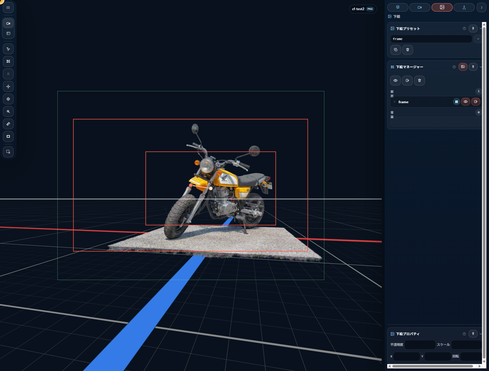
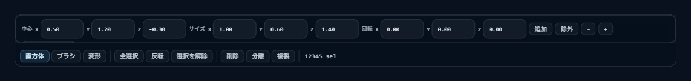

# スプラット編集

**スプラット編集** は、スプラットアセット内の個別のスプラット（単位：粒）を選択・削除・分離・複製・変形する専用モードです。Gaussian splatting ならではのクリーンナップや分割に使います。

## 1. 概念

### 選択状態はモードを抜けると消える

どのスプラットを選択しているかという情報は、**スプラット編集モードの中だけで保持**されます。モードを抜けたりプロジェクトを保存したりしても残りません。次にスプラット編集へ入り直したときは、選択なしの状態から始まります。

一方、モード中の元に戻す / やり直し履歴には選択操作も含まれるので、編集セッション中の操作はいつでも巻き戻せます。

### 編集結果はプロジェクトに保存される

`Delete` / `Separate` / `Duplicate` / `Transform` で行った編集の結果は、スプラットアセットそのものに反映され、`.ssproj` の保存にも含まれます。後からプロジェクトを開き直しても、編集後の状態が再現されます。

### 編集は事前計算済み LoD を無効化する

パッケージ保存で `Quality` を選んで焼き込んだ LoD は、スプラット編集（`Delete` / `Separate` / `Duplicate` / `Transform`）を行うと自動的に破棄されます。LoD ツリーはスプラットのインデックスに紐付いているため、内容が変わると整合性が取れなくなるためです。

編集後の現在の表示を軽くしたい場合は、スプラット編集ツールバーの `LoD 最適化` を実行します。次回読込み直後から高速化したい場合は、次回のパッケージ保存で `Quality` を選んで焼き直してください。

RAD streaming cache 付きのアセットでも、編集に入る時は FullData に切り替えてから操作します。編集後の RAD cache は破棄され、次回 `Quality` 保存で作り直されます。

シーンマネージャーで 3DGS オブジェクト自体を移動・回転・拡縮する操作はスプラット内容を変えないため、RAD streaming cache と焼込み済み LoD は維持されます。

## 2. 入口

| 入口 | 操作 |
|---|---|
| **キーボード** | `Shift+E` |
| **ツールレール** | スプラット編集ボタン |
| **パイメニュー** | （現行は未登録） |

モードに入るとビューポート内に専用ツールバーが現れます。対象となるスプラットアセットは自動で決定されます。シーンにスプラットアセットが 1 つも無い場合は入れません（エラー表示）。

## 3. ツールバーの構造

ツールバーはドラッグで好きな位置に動かせます。位置はプロジェクトをまたいで記憶されます。

### グループ 1: ツール選択

| ボタン | 機能 | 有効条件 |
|---|---|---|
| **Box** | 矩形選択ツール | 常時 |
| **Brush** | ブラシ選択ツール | 常時 |
| **Transform** | 選択スプラットの変形 | 選択あり |

### グループ 2: 選択操作

| ボタン | ショートカット | 機能 |
|---|---|---|
| **Select All** | `Ctrl+A` | 対象内の全スプラットを選択 |
| **Invert** | `Ctrl+I` | 選択を反転（要: 選択あり） |
| **Clear** | `Ctrl+D` | 選択をクリア（要: 選択あり） |

### グループ 3: 編集アクション

| ボタン | 機能 | 有効条件 |
|---|---|---|
| **Delete**（危険操作スタイル） | 選択スプラットを削除 | 選択あり |
| **Separate** | 選択スプラットを別アセットとして切り出し | 選択あり |
| **Duplicate** | 選択スプラットを複製 | 選択あり |
| **LoD 最適化** | 対象 3DGS の描画用 LoD を再構築 | 大きい対象 3DGS があり、未最適化または編集後 |

### 右端: 選択数

`${splatEditSelectionCount} sel` と常時表示。

## 4. Box ツール

向き付きの矩形でスプラットを囲んで選択するツール。

### 4.1 Box の配置

- ビューポート上をクリックすると、クリック位置のシーン上の点を中心に Box が配置されます
- 一度配置した Box はそのまま残り、パラメータで細かく調整できます

### 4.2 Box のパラメータ編集

ツール専用のポップオーバーでパラメータを触れます。

- **中心** — X / Y / Z
- **サイズ** — X / Y / Z
- **回転** — X / Y / Z（Euler 角 → クォータニオン）
- **均等スケール** — 一括倍率
- **Fit to Scope** — 対象アセットの境界に合わせる

### 4.3 選択適用

Box 配置後の **Apply** ボタン（または確定操作）で、Box 内に中心があるスプラットを選択に反映します。

| モディファイア | 挙動 |
|---|---|
| なし | 選択に **追加** |
| `Alt` | 選択から **減算** |

判定は Box の向きを考慮した厳密な内外判定です。

## 5. Brush ツール

円形ブラシでカーソル付近のスプラットを選択するツール。

### 5.1 ブラシサイズ

| フィールド | 単位 | 範囲 |
|---|---|---|
| **サイズ** | px | 4 〜 400 |

ブラシプレビュー（リング）がカーソル位置に表示されます。

### 5.2 深度モード

ブラシが選択する「奥行き範囲」を制御。

| モード | 意味 |
|---|---|
| **`through`** | 奥行き制限なし（無限円柱で選択） |
| **`depth`** | 指定深度値で制限（有限円柱） |

深度モード = `depth` のとき、深度の数値は `0.01` 以上に制限されます。

### 5.3 減算モード（`Alt`）

- 通常 — 選択に追加
- `Alt` 押下中 — 選択から減算

ブラシプレビューの色が減算モードでは変化し、ペイント中もスタイルが変わるので、現在の動作モードが見てわかります。

### 5.4 ブラシプレビュー の構成

| 要素 | 表示条件 |
|---|---|
| **リング** — 円形アウトライン | ブラシ使用中は常時 |
| **奥行きバー** — 奥行きインジケータ | 深度モード = `depth` のとき |

### 5.5 ブラシ中のナビゲーション

ブラシツール中のナビゲーション:

- **左ドラッグ** — ペイント（選択追加 / 減算）
- **`Shift +` 右ドラッグ** — パン（視点移動）
- **右ドラッグ** — アンカーオービット（`Ctrl+` 左ドラッグと同等）
- **ホイール** — ドリー / ズーム

ペイント以外の操作は通常のビューポート操作と同じです。

## 6. 変形ツール

選択スプラットを直接変形するツール。

### 6.1 使い方

1. Box / Brush でスプラットを選択
2. 変形ツールに切替
3. 変形ギズモが表示される
4. ギズモをドラッグして選択スプラットを移動 / 回転 / スケール

### 6.2 ギズモの構成

- **移動軸**（X / Y / Z）
- **移動平面**（XY / YZ / ZX）
- **回転リング**（X / Y / Z）
- **均等スケールハンドル**

### 6.3 ピボット

ギズモのピボット（変形の中心）は、選択スプラットの境界の中央がデフォルトです。

### 6.4 元に戻す / やり直し

変形操作は履歴に記録され、`Ctrl+Z` で巻き戻せます。

### 6.5 適用フロー

ドラッグ中は仮表示でプレビューされ、ドラッグを離した瞬間に確定されます。確定後は `.ssproj` 保存にも含まれる形で反映されます。

## 7. 選択操作

### 7.1 Select All（`Ctrl+A`）

対象内の**全アセットの全スプラット**を選択に追加します。大量データでは時間がかかります。

### 7.2 Invert（`Ctrl+I`）

現在の選択を反転します。選択中スプラットは除外され、非選択スプラットが選択されます。

### 7.3 Clear（`Ctrl+D`）

選択をすべてクリアします。

## 8. 編集アクション

### 8.1 Delete

選択スプラットを削除します。残ったスプラットだけでアセットが作り直され、選択はクリアされます。選択で全てのスプラットを削除した場合はアセット自体が削除されます。元に戻せます。

### 8.2 Separate

選択スプラットを**別アセット**として切り出します。切り出し後、新アセットが元アセットの直上に挿入されて自動選択になり、元アセットからは該当スプラットが抜けます。

例えば建物と人物が 1 つのアセットに入っていたら、人物を選択して `Separate` することで、人物を独立アセットとして扱えるようになります。

### 8.3 Duplicate

選択スプラットを**複製**します。元アセットは変更されず、新アセットだけが元アセットの直上に挿入されて自動選択されます。`Separate` と違い、元アセットからスプラットが「抜ける」ことはありません。

## 9. シーンアセットとの関係

スプラット編集は **スプラットアセットのみ**に適用できます。

| 種類 | スプラット編集 |
|---|---|
| スプラット | 対応（本章の全機能） |
| モデル（glTF / glb） | **非対応**（選択もツールも無効） |

モデルの編集は外部 3D ツールで行い、再度読み込み直してください。

## 10. モード終了時の挙動

`Shift+E` を再度押すとスプラット編集から抜けます。抜ける際:

- 進行中のブラシストロークは確定またはキャンセルされる
- 変形プレビューや Box の仮配置はクリアされる
- 選択ハイライトは消える

選択は次回入り直すとリセットされます（§1 参照）。

## 11. 関連ショートカット

| キー | 動作 |
|---|---|
| `Shift+E` | スプラット編集モード切替 |
| `Ctrl+A` | 全スプラットを選択 |
| `Ctrl+I` | 選択を反転 |
| `Ctrl+D` | 選択をクリア |
| `Alt`（ブラシ中） | 減算モード |
| `Delete` / `Backspace` | 選択スプラットを削除 |

## 12. 関連章

- スプラットアセット全般: [シーンアセット](04-scene-assets.md)
- ビューポートツールとパイメニュー: [ビューポートとツール](08-viewport-tools.md)
- 編集結果の書き出し側: [書き出し](10-export.md)
