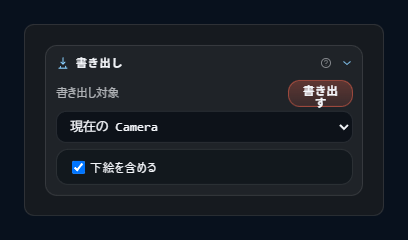
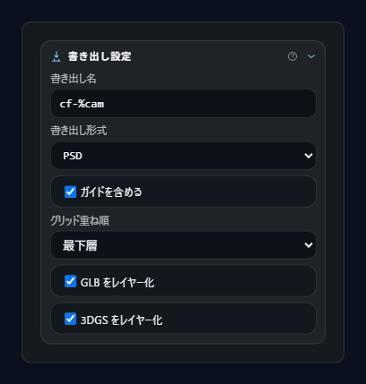
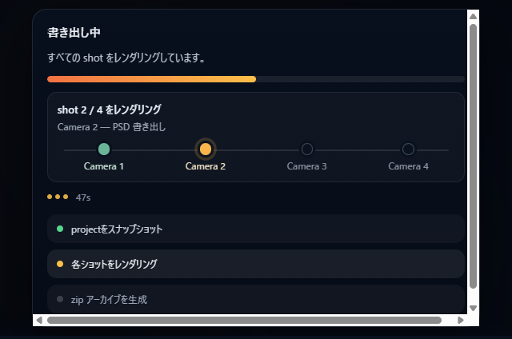

# 書き出し

CAMERA_FRAMES の **書き出し** は、ショットカメラ 単位で紙面（用紙）に沿った画像を書き出す機能です。出力は **PNG** または **PSD**（レイヤー付き）。

インスペクター の 書き出し タブで設定し、**Output** セクションの **Download Output** ボタンで実行します。

## 1. Output セクション

### 1.1 書き出し対象

| target | 意味 |
|---|---|
| **`current`** | 現在 active な ショットカメラ のみを 書き出し（デフォルト） |
| **`all`** | workspace 内の全 ショットカメラ を 書き出し |
| **`selected`** | 明示的にチェックした ショットカメラ のみを 書き出し |

`selected` 選択時は ショットカメラ のチェックリストが出現し、対象を選びます。何も選択されていない状態では Download ボタンが disabled になります。

### 1.2 Include Reference Images

チェックボックス。書き出し 実行 単位で、下絵 を出力に含めるかを切り替えます。

### 1.3 Download Output

書き出し を実行するボタン。ボタンは以下の時に disabled:

- 書き出し実行中（`exportBusy`）
- `selected` target で 1 つも選ばれていない

## 2. 書き出し設定 セクション（ショットカメラ ごと）

ショットカメラ ごとに異なる設定を持てます。

### 2.1 書き出し名（ファイル名テンプレート）

| 設定 | 例 |
|---|---|
| テンプレート | `cf-%cam` |
| 変数 | `%cam` → ショットカメラ の名前 |

**ファイル名の正規化**:

- `\/:*?"<>|` と連続空白 → `-` に置換
- 連続ハイフン `-+` → `-` に圧縮
- 先頭末尾のハイフンを削除

**Batch 時の sequence suffix**: 同じベース名が複数ある場合のみ `-01`、`-02` のような連番が付与されます（1 つだけなら suffix なし）。

### 2.2 書き出し形式

| format | 拡張子 | 用途 |
|---|---|---|
| **`png`** | `.png` | 合成済み 1 枚画像 |
| **`psd`** | `.psd` | レイヤー分け画像（Photoshop 形式） |

### 2.3 Grid Overlay

チェックボックス。ON / OFF の切替。ON のときに **Grid Layer Mode** が現れます。

### 2.4 Grid Layer Mode（Grid Overlay ON 時のみ）

| mode | 効果（PSD 構造上の位置） |
|---|---|
| **`bottom`** | Grid レイヤーが Render より**下**に配置（背景より上） |
| **`overlay`** | Grid レイヤーが Render より**上**に配置（最上部寄り） |

PNG では単に合成順に影響します。

### 2.5 Model Layers（PSD 形式のみ）

チェックボックス。

- ON — PSD にモデルアセットを個別レイヤーとして出力
- OFF — モデルも背景に統合される

### 2.6 スプラット Layers（PSD + Model Layers 両方 ON 時のみ）

チェックボックス。

- ON — スプラット アセットも個別レイヤーとして出力
- OFF — スプラット は統合される

Model Layers が OFF の場合、自動的に disabled になります。

## 3. 書き出し 実行フロー

### 3.1 開始

**Download Output** ボタンを押すと:

1. `exportBusy = true` に設定、UI が disabled に
2. target documents を解決（current / all / selected）
3. 各 document に対し 書き出し bundle を構築
4. Progress overlay が表示される

### 3.2 Phase（進捗フェーズ）

Progress overlay には各フェーズが列挙されます。`todo` → `active` → `done` と遷移。

| フェーズ | 対象 |
|---|---|
| **prepare** | 準備（readiness check など） |
| **beauty** | メインレンダリング |
| **guides** | Grid / Eye Level（Grid Overlay ON 時） |
| **masks** | フレームマスク（mask あり時） |
| **psd-base** | PSD ベース合成（PSD + Model Layers 時） |
| **model-layers** | Model layers（PSD + Model Layers 時） |
| **スプラット-layers** | スプラット layers（PSD + スプラット Layers 時） |
| **reference-images** | 下絵（Include Reference Images 時） |
| **write** | ファイル書き込み |

### 3.3 完了

ファイルがダウンロードされ、summary と status メッセージが出ます。

- **PNG 単体** → `status.pngExported`
- **PNG batch** → `status.pngExportedBatch { count }`
- **PSD** → `status.psdExported`
- **Mixed** → `status.exportedMixed`

### 3.4 エラー

失敗時は Error overlay が出て、stack trace / message が詳細に表示されます。

## 4. PNG 書き出し

### 4.1 構成

PNG は全レイヤーを **合成した 1 枚画像**として書き出されます。合成順は PSD と同じルール（Grid Layer Mode などを反映）。

### 4.2 合成の特徴

CAMERA_FRAMES の PNG 合成は **linear-space**（sRGB 変換して線形で合成、その後 sRGB に戻す）で行われます。

- sRGB → Linear 変換: ルックアップテーブル使用
- Pre-multiplied alpha blending: 各レイヤーを順に alpha 合成
- Linear → sRGB 逆変換: 最終ピクセルに適用

これにより、通常の sRGB 合成で起きる色ずれを避けて、物理的に正しい合成結果を得ます。

## 5. PSD 書き出し

### 5.1 レイヤー構造

PSD は **bottom-to-top**（一番下が先）のスタック順で格納されます。Photoshop で開くと**上から**表示されます。

レイヤー順序（下から上）:

1. **Background**（あれば）
2. **下絵 (Back)**（group）— Grid Layer Mode = `bottom` の時
3. **Grid** — Grid Layer Mode = `bottom` の時
4. （Grid Layer Mode = `overlay` の場合は 下絵 Back のみ先に出力）
5. **Render** — メインレンダリング
6. **スプラット Layers**（reversed）— スプラット Layers ON 時
7. **Model Layers**（reversed）— Model Layers ON 時
8. **Grid** — Grid Layer Mode = `overlay` の時
9. **Eye Level**
10. **下絵 (Front)**（group）
11. **フレーム**（group）
    - frame overlay layers
    - 軌道 layer（`trajectoryExportSource` ≠ `none` の時）
12. **Mask**（hidden、opacity 0.8、フレームマスク shape に応じた描画）

### 5.2 主要レイヤーの詳細

#### Render

ショットカメラ から見たメインの描画結果（スプラット + model が統合された beauty pass）。

#### Model Layers

各 model アセットを個別レイヤーとして出力。reversed されているので scene manager の並びが PSD の上から順に一致します。

#### スプラット Layers

同上で スプラット アセット版。

#### 下絵（Back / Front）

プリセット の item が、`back` / `front` group ごとにレイヤーグループとして格納されます。各 layer の `left` / `top` / `opacity` が反映されます。

#### Grid / Eye Level

ビューポート で guide として見えていた grid と eye level（水平線）が、別レイヤーとして出力されます。

#### フレーム group

各 フレーム の枠線やアノテーションが `フレーム` group に入ります。`trajectoryExportSource` が `none` 以外なら、同じ group に 軌道 layer が追加されます。軌道 layer の名前は source によって変わります（`trajectory`, `Trajectory Top Left` 等）。

#### Mask（hidden）

フレームマスク が出ていた場合、その領域を示す Mask レイヤーが **hidden = true**（初期状態で非表示）、**opacity 0.8** で追加されます。PSD 側で目立たせたい時だけ表示すれば OK。

- fill color: `rgb(3, 6, 11)`（暗めのグレー）
- shape: フレームマスク の `shape`（`bounds` / `trajectory`）に応じた形状

### 5.3 Metadata

PSD ファイルに以下のメタ情報が埋め込まれます。

- **解像度**: 150 DPI（horizontal / vertical）
- **単位**: インチ
- **サムネイル**: max 256 px
- **compression**: オフ（ファイルサイズ優先より速度 / 互換性優先）

## 6. フレームマスク の 書き出し 反映

### 6.1 Mask mode と対象フレーム

| `frameMask.mode` | 書き出し |
|---|---|
| `off` | mask なし |
| `on` | 全 フレーム の外側を mask |
| `selected` | 選択フレームのみ mask |

### 6.2 Shape

| `shape` | 形状 |
|---|---|
| `bounds` | フレーム 矩形のバウンディング（1 フレーム ならそのまま、複数なら共通の向きでまとめたバウンディング、向きがバラバラなら軸並行のバウンディング） |
| `trajectory` | フレーム 軌道のスイープ領域 |

### 6.3 軌道 書き出し Source

| source | PSD 出力 |
|---|---|
| `none` | 軌道 layer なし |
| `center` | `trajectory`（フレーム center 起点） |
| `top-left` | `Trajectory Top Left`（フレーム 左上 corner 起点） |
| `top-right` | `Trajectory Top Right` |
| `bottom-right` | `Trajectory Bottom Right` |
| `bottom-left` | `Trajectory Bottom Left` |

各 フレーム の起点に、**軌道線と直交する tick mark** が同じレイヤーに描かれます。

## 7. 書き出し前の状態要件

### 7.1 LoD settle（warmup）

スプラット アセットがある場合、LoD（level of detail）を安定させるため **最低 2 pass の warmup** が要求されます。

- `minWarmupPasses`: 0（デフォルト）
- `splatWarmupPasses`: 2（スプラット アセットがある場合）
- `maxWaitMs`: 1500 ms（タイムアウト）

### 7.2 Active ショットカメラ

`current` target では、active shot が存在しないと 書き出し できません（エラー表示）。

### 7.3 下絵 の可用性

Include Reference Images が ON でも、source file が取得できない item は layer には出ません（存在しないファイルはスキップ）。

## 8. Undo / Redo

各 書き出し設定の変更は history に記録されます。

- `camera.export-name`
- `camera.export-format`
- `camera.export-grid`
- `camera.export-grid-layer`
- `camera.export-model-layers`
- `camera.export-splat-layers`

`Ctrl+Z` / `Ctrl+Y` で巻き戻し / やり直せます。

## 9. 関連章

- ショットカメラ と 書き出し name: [ショットカメラ](05-shot-camera.md)
- フレーム / フレームマスク / 軌道: [用紙 と フレーム](06-output-frame-and-frames.md)
- 下絵 参加条件: [リファレンス画像](07-reference-images.md)
